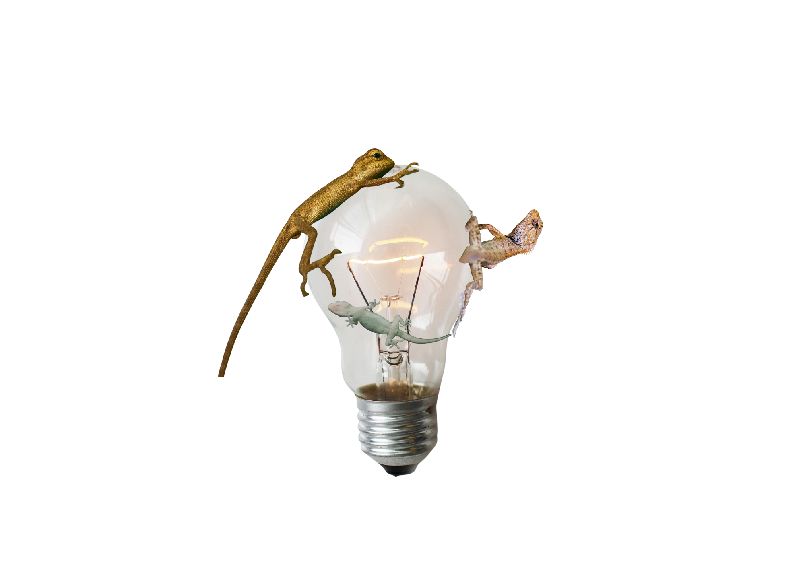

### Zastanawiasz się nad wymianą przepalonej żarówki, ale nie wiesz jak się za to zabrać? Każdy ma jakieś preferencje co do oświetlenia. Nie każde z nich są jednak zdrowe i bezpieczne. Jakie korzyści i wady płyną z barwy i mocy światła? Czy człowiek to tak naprawdę zależna od światła jaszczurka?

Wyobraźmy sobie niewielkich rozmiarów terrarium. Jest szklane, stoi gdzieś pod ścianą, niczym modny dodatek. Oświetla je wewnątrz mocne światło. W środku widać zieleń zasadzonych w nim roślin oraz trochę szarych kamieni, na których wygrzewa się bliżej niesprecyzowany gatunek gada. Nic nadzwyczajnego, w końcu często mówi się, że ktoś wygrzewa się na słońcu jak jaszczurka – i jak ona spłaszcza się, jakby promienie słoneczne roztapiały ją niczym pozostawione w lato lody. Nie wszyscy jednak wiedzą, że nie jest to jedynie kwestia upodobań czy preferencji co do temperatury otoczenia.

Gady należą bowiem do grupy zwierząt ektotermicznych. Oznacza to, że ze względu na niski poziom metabolizmu muszą polegać na środowisku zewnętrznym w celu ogrzania się. Nie jest to jednak takie proste, jak ustawienie bardzo ciepłej żarówki na cały dzień. Zwierzęta te potrzebują różnorodności promieniowania UV, które wpływa na ich odpowiedni rozwój, pomagając na przykład zachować rytm dnia i nocy. Dzieje się tak dlatego, że są one w stanie rozpoznać zmieniające się pory dnia oraz pory roku, a to dzięki identyfikacji intensywności oraz koloru światła. Wszystko zależy oczywiście od gatunku jaszczurki oraz specyfikacji jej funkcjonowania, ponieważ, tak jak ludzie, każdy gad jest inny. Dla przykładu gady nocne mają cieńszą i bardziej przezroczystą skórę, ponieważ ze względu na godziny funkcjonowania muszą polegać na świetle odbitym, które jest słabsze i bardziej rozproszone.

> Ile tak naprawdę mamy wspólnego z jaszczurkami? Z pewnością  tak samo jak one potrzebujemy różnorodnego światła do prawidłowego funkcjonowania.

Brzmi naukowo lub egzotycznie? Każdy, komu nasunęła się taka myśl, powinien pomyśleć o tych wszystkich razach, gdy światło było nie takie, jak być powinno. Kiedy podczas nauki trzeba było zapalić jaśniejsze światło dla lepszego skupienia lub wieczorem zmieniano _big lights_ (lampy sufitowe) na _small lights_ (lampki, świeczki, niewielkie lampy) w celu odpoczynku i wyciszenia się po długim dniu. Pojawia się więc pytanie – ile tak naprawdę wspólnego mamy z jaszczurkami? W końcu nasz metabolizm nie opiera się na działaniu bodźców zewnętrznych. 

Zacznijmy od tego, że w dniu człowieka rozróżnia się trzy typy światła: zimne, neutralne oraz ciepłe. Odpowiednia dawka każdego z nich jest odpowiedzialna za prawidłowe funkcjonowanie organizmu, nasz nastrój oraz zdrowie.

Jak wygląda to od strony technicznej? Na opakowaniach żarówek kryje się wiele informacji, które mogą pomóc nam wybrać tę idealną. Zaczynając od koloru, bo przecież to jest punktem głównym naszej rozmowy, należy zwrócić uwagę na liczbę Kelwinów. Im parametr ten jest wyższy, tym zimniejszy odcień kupujemy. Barwa neutralna oscyluje w granicach 3300–4500 [K] (oznaczenie Kelwinów). Temperatura barwowa to jednak nie wszystko, co powinno skupić naszą uwagę. Przy okazji warto pomyśleć o faktycznym natężeniu światła, które chcemy, żeby nasza żarówka emitowała. Tego możemy dowiedzieć się z ilości lumenów. W tym przypadku jest to bardzo prosta sprawa – im więcej lumenów, tym jaśniej będzie świecić. Proste? Do momentu, aż trzeba faktycznie wybrać tą odpowiednią, stojąc w alejce sklepowej.

> Nikt nie powinien zaglądać innym do łóżka, więc po co zaglądać komuś do lamp?

Rozmowę na temat preferencji najlepiej rozpocząć od nauki. Według badań czerwone światło (bądź światło z domieszką czerwieni) jest najbardziej wartościowym wyborem. Barwa ta wpływa pozytywnie na proces regeneracji oraz wspomaga odpowiedni rytm dnia i nocy. Zespół z Uniwersytetu w Göteborgu dla potwierdzenia tej teorii przeprowadził badanie na ofiarach wypadków oraz ciężko chorych pacjentach na oddziałach intensywnej terapii. Z jego raportu wynika, że zastosowanie żarówek adaptujących kolor i natężenie światła naturalnego w odpowiednich porach dnia wpłynęło pozytywnie na rekonwalescencję oraz samopoczucie pacjentów. Może to dobry moment, żeby służba zdrowia doszła do wniosku, że takie rozwiązanie jest lepsze, niż zimne, intensywne światło szpitalne?

Pojawią się jednak zapewne głosy popierające zastosowania takowego światła. Czasem faktycznie można spotkać na swojej drodze kogoś, kto umyślnie montuje w salonie, – bądź, co gorsza, w sypialni – żarówki emitujące białą barwę. Natomiast w opozycji znajdują się osoby, które cenią sobie oświetlenie spokojne, żółte oraz jak najmniej inwazyjne. Można by zostawić ten spór i przyznać, że przecież zależy to jedynie od preferencji i niech takie osoby nie wchodzą sobie zwyczajnie w drogę. Nikt nie powinien zaglądać innym do łóżka, więc po co zaglądać komuś do lamp?

Niestety z medycznego punktu widzenia nie jest to takie proste. Długotrwałe wystawienie na działanie niebieskiego światła (szczególnie takiego powyżej 7000 Kelwinów) ma negatywny wpływ na naszym zdrowie. Taka ilość sztucznego światła zaburza rytm okołodobowy człowieka, co klasyfikuje się jako jeden z prawdopodobnych czynników rakotwórczych. Dodatkowo nastawienie na jego działanie bezpośrednio przed snem hamuje produkcję melatoniny, co wpływa bezpośrednio na zaburzenia snu. Żeby jednak nie demonizować w pełni białego oświetlenia, powinno się wspomnieć również o jego pozytywnych stronach. Wspomaga ono skupienie, nadaje się do przestrzeni pracy oraz nauki i działa jako impuls dla mózgu pobudzający do działania. 

Jakie światło jest w takim razie najlepsze? Odpowiedź jest prosta – jak najbardziej naturalne. Istnieją badania potwierdzające połączenie kontaktu z naturalnym światłem z mniejszym rozwojem krótkowzroczności u dzieci. Co więcej, według statystyk, osoby mające z nim styczność niedługo po przebudzeniu – są szczuplejsze. Wynika to z jego wpływu na metabolizm człowieka. Czyli jednak mamy coś wspólnego z jaszczurkami! Jest to powiązane z regulacją zegara biologicznego, co prowadzi do lepszej jakości snu. Im mniej snu, tym organizm wydziela więcej hormonu głodu. Wniosek? Naturalne światło to naturalny sposób na zdrową i szczupłą sylwetkę!

> Odpowiednio zrównoważona dawka białego, neutralnego i żółtego światła jest odpowiedzialna za prawidłowe funkcjonowanie organizmu człowieka, za jego nastrój oraz zdrowie.

Wszystko sprowadza się do tego, że pomimo badań i zaleceń, nie istnieje jednoznaczna odpowiedź na to, jaki rodzaj sztucznego oświetlenia jest w stu procentach najlepszy dla każdej jednostki. W zależności od pory dnia, stylu pracy, upodobań i pomieszczenia, powinniśmy zastanowić się nad doborem odpowiednich żarówek. Tylko wtedy uzyskamy optymalnie najlepsze efekty, a ostatecznie w naszej codzienności zawita ulga podobna do tej, którą odczuwamy w naturalnym środowisku.
Podsumowując: dbajmy o siebie na co dzień tak bardzo, jak właściciele jaszczurek dbają o ich zdrowie i komfort życia. Bo mieszkanie to przecież nic innego, jak terrarium dla człowieka.
 

---

#### Bibliografia:
#### Frances M. Baines, [_Reptile Lighting Information. Information on how natural and artificial lighting affects reptiles_](https://reptilesmagazine.com/reptile-lighting-information/), „Reptiles”, 6 marca 2013, dostęp: 11 grudnia 2025

#### Marie Engwall, [_Patients in intensive care feel better with light adapted to the time of day_](https://www.gu.se/en/news/patients-in-intensive-care-feel-better-with-light-adapted-to-the-time-of-day), University of Gothenburg, 15 marca 2017, dostęp: 17 grudnia 2025

#### Marek Matacz, [_Jak światło wpływa na nasze zdrowie i samopoczucie_](https://zdrowie.pap.pl/srodowisko/jak-swiatlo-wplywa-na-nasze-zdrowie-i-samopoczucie), „Serwis Zdrowie”, 2 stycznia 2019 (aktualizacja: 10 stycznia 2025), dostęp: 2 stycznia 2026
