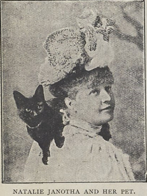

### Wspinaczka, choć wciąż była daleka od tej, którą znamy dziś, niosła za sobą poczucie przygody i przekraczania własnych ograniczeń. Choć ten drugi rodzaj górskiej aktywności był w XIX wieku przeważnie domeną mężczyzn, na pamiątkowych zdjęciach, wśród piętrzących się skał i stromych szczytów, można dostrzec także kobiety. Ich obecność wśród skalistych krajobrazów świadczyła o tym, że góry zaczynały być przestrzenią bardziej otwartą, choć w dalszym ciągu pełną ograniczeń.

### Wstęp

Dzięki nowym możliwościom szybkiego podróżowania koleją w XIX wieku bardzo szybko rozwijała się różnego rodzaju turystyka, w tym także turystyka górska. Podróż, która dawniej wymagała długich tygodni, skomplikowanych przygotowań i znacznych kosztów, stała się łatwiejsza, krótsza i bardziej osiągalna. Kolej nie tylko skróciła dystanse, lecz także zmieniła sposób myślenia o podróżach. Góry, dotąd postrzegane jako obszary dzikie i nieprzystępne, zaczęły stopniowo zyskiwać w oczach społeczeństwa.[^1]

Tatry zaistniały w świadomości Polek i Polaków jako miejsce atrakcyjne turystyczne i dobre dla zdrowia. Nie wszyscy jednak decydowali się na to samo oblicze górskich wycieczek. Niektórzy trzymali się bezpiecznych spacerów, wybierając łagodniejsze trasy, które nie wymagały ani szczególnego wysiłku, ani odwagi. Inni natomiast, prowadzeni przez góralskich przewodników, zdobywali skaliste szczyty. To właśnie oni wybierali trudniejszą drogę, decydując się na wysiłek fizyczny i kontakt z bardziej wymagającym obliczem gór.[^2]

Wspinaczka, choć wciąż była daleka od tej, którą znamy dziś, niosła za sobą poczucie przygody i przekraczania własnych ograniczeń. Choć ten drugi rodzaj górskiej aktywności był w XIX wieku przeważnie domeną mężczyzn, na pamiątkowych zdjęciach, wśród piętrzących się skał i stromych szczytów, można dostrzec także kobiety. Ich obecność wśród skalistych krajobrazów świadczyła o tym, że góry zaczynały być przestrzenią bardziej otwartą, choć w dalszym ciągu pełną ograniczeń. Zwłaszcza, że ówczesne stroje damskie z pewnością nie zachęcały do długich wspinaczek i zdobywania wysokich szczytów. Kobiecy strój, był nie tylko wyrazem obowiązujących norm społecznych, ale także fizyczną przeszkodą. Mimo to coraz więcej kobiet nie dawało się tak łatwo zniechęcić.
W górach nie było miejsca ani na paradne przechadzki ani na spacerową swobodę znaną z miejskich promenad. Drogi, ciągnące się przez wsie były podczas deszczu zupełnie zabłocone, a podczas suszy zakurzone. Teren nie sprzyjał tkaninom miejskich strojów ani delikatnemu obuwiu. Góry szybko zmusiły przyjezdnych do podporządkowania się warunkom, jakie narzucała im przyroda. 
Żeby nie zniszczyć wytwornych strojów, kobiety brały ze sobą suknie perkalowe, płócienne lub muślinowe. Natomiast na chłodniejsze dni panie wybierały suknie wełniane, które dawały większą ochronę przed zimnem i wiatrem, tak częstymi w górskim klimacie. Był to kompromis pomiędzy obowiązującymi normami społecznymi, a koniecznością dostosowania się do realiów górskich wędrówek. Ze względu na zmienną górską pogodę kobiety nosiły przy sobie także pled, czyli gruby koc, służący do okrycia się. Stanowił on element praktyczny i niezbędny, zważając na to, że pogoda górska potrafiła zmienić się gwałtownie.
Panie, które wybierały się na wyższe partie gór, decydowały się jednak na inne rozwiązania. Wyruszały w krótszych sukniach, sięgających jedynie do kostek. Choć odbiegało to od standardów epoki, było znacznie bardziej funkcjonalne. Do tego nosiły proste, słomiane kapelusze z szerokim rondem, które chroniły przed słońcem i deszczem. Funkcjonalność zaczynała więc przeważać nad estetyką, choć były wyjątki. Panie nawet na wysokie szczyty wchodziły ściśnięte gorsetami.
Górska rzeczywistość wymuszała także rezygnację z wielu przyzwyczajeń i uczyła, że w tym krajobrazie liczy się przede wszystkim praktyczność i zdolność przystosowania się do warunków. Przykładem były tak powszechne w codziennym użytku, parasolki, które w górach były uznawane za prawdziwą przeszkodę.[^3]
Choć przewodnicy górale bardzo chętnie wyszukiwali dla kobiet najwygodniejszych tras, prowadząc je przez trudniejszy teren, one same przechodziły przez wodę i przeskakiwały z kamienia na kamień czy ze skały na skałę. 
Wysokie obcasy były więc zupełnie niepraktyczne i nie nadawały się do takiego terenu. Zamiast nich potrzebne były buty miękkie, skórzane, z niskim obcasem lub całkowicie bez niego, osadzone na grubej, solidnej podeszwie. Tego rodzaju obuwie pozwalało paniom lepiej utrzymać równowagę i chroniło ich stopy przed ostrymi kamieniami, czy wilgocią. Bez dwóch par takiego obuwia kobiety nie mogły się obyć. Jedna para zawsze znajdowała się u szewca w naprawie, druga natomiast była w użyciu podczas kolejnych wypraw. Zdarzało się jednak, że jakaś szczególnie zawzięta pani odważyła się wyruszyć na górską wyprawę w wysokich obcasach, kierując się przyzwyczajeniem lub chęcią zachowania elegancji. Takie decyzje szybko okazywały się nietrafione. W trudnym terenie obcasy klinowały się między kamieniami, ślizgały na mokrych powierzchniach i uniemożliwiały pewne stawianie kroków. W skrajnych przypadkach górale musieli je później odcinać siekierą, aby kobieta mogła swobodnie i bezpiecznie iść dalej.[^4]

Panna Natalia Janotha i Maria Wolska to postacie, które w drugiej połowie XIX wieku łamały stereotypy dotyczące kobiecej wspinaczki górskiej. 22 sierpnia 1883 roku Natalia Janotha, polska pianistka, kompozytorka i jedna z pierwszych polskich taterniczek, stanęła jako pierwsza kobieta na szczycie Gerlacha, najwyższej góry w Tatrach (2655 m n.p.m.). Ragę jej osiągnięcia potęguje fakt, że mało kto potrafił wspiąć się na owy szczyt. To wzbudzało w innych taternikach nie tylko podziw, ale również zazdrość. Natalia Janotha nie była jednak turystką, która przy odrobinie szczęścia i męskiej pomocy, zdobyła szczyt. Była zapaloną taterniczką, Ponad to była jedną z pierwszych kobiet, które po górach chodziły w spodniach. To w XIX wieku stanowiło ogromne naruszenie społecznych oczekiwań. Jej dokonania stanowią przykład tego, jak kobietom udawało się przekraczać zarówno fizyczne, jak i kulturowe granice epoki. W Tatry jeździła intensywnie w latach 1880–1883, zdobywając kolejno Łomnicę, Gerlach i kilka innych szczytów. Każde takie wejście było aktem odwagi i stanowczym zademonstrowaniem, że kobiety nie tylko potrafią aktywnie uczestniczyć w ’’męskich’’ rozrywkach, ale mogą również wyznaczać nowe standardy.[^5]

Kilka lat wcześniej, bo 5 września 1879 roku, inną ważną kartę w historii kobiet zapisała panna Maria Wolska z Kujaw, która weszła na Łomnicę, czyli drugi co do wysokości szczyt Tatr (2634 m n.p.m.). Wyczyn Wolskiej był szczególnie godny podziwu, ponieważ Łomnica, znana także jako „królowa Tatr”, przez długi czas uchodziła za jeden z najtrudniejszych do zdobycia szczytów.[^6]

Obydwie te Polki weszły na same szczyty, nie tylko dokumentując swoją obecność, ale inspirując kolejne pokolenia kobiet do aktywności, samodzielności i odwagi. Te dwie, a także wiele innych historii kobiet taterniczek, są świadectwem, że już wtedy Polki potrafiły konkurować z mężczyznami w dziedzinach wymagających siły, wytrzymałości i determinacji. Ich dokonania powinny być obecne nie tylko w kronikach górskich, ale również w ogólniejszej narracji o prawach i możliwościach kobiet w historii Europy.  

[^1]: Lucyna Ćwierczakiewicz, Zakopane, Tygodnik Bluszcz, 1874
[^2]: Lucyna Ćwierczakiewicz, Zakopane, Tygodnik Bluszcz, 1874
[^3]: Władysław Ludwik Anczyc, Zakopane i lud podhalski, Tygodnik Ilustrowany, 1874
[^4]: Lucyna Ćwierczakiewicz, Zakopane, Tygodnik Bluszcz, 1874. 
[^5]: W. E., w Wędrowiec, 1883
[^6]: W. E., w Wędrowiec, 1883