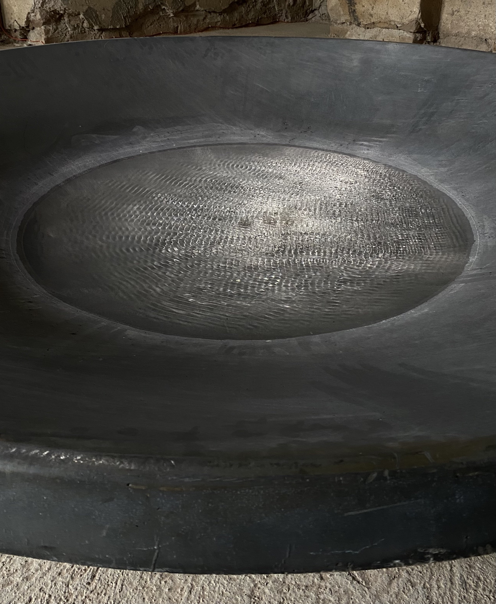

### Człowiek często zapomina, że nie jest niezależnym, niezniszczalnym bytem i traktuje przyrodę jako gorszą od siebie, podległą i zdatną głównie do wykorzystywania bez konsekwencji. Instalacja Fractured Reflections autorstwa Sefy Sagira i Anny Klimczak zaprzecza temu sposobowi myślenia i zakłada równość tych dwóch światów, odzwierciedlając punkt widzenia natury i stawiając go na równi z perspektywą człowieka.

_Fractured Reflections_ autorstwa Sefy Sagira i Anny Klimczak to instalacja dźwiękowa pokazywana na wystawie Po deszczu, której kuratorkami były Jaga Hupało i Anna Klimczak. Projekt realizowany w ramach Pasma Sztuki organizowanego przez Ostoje Sztuki. Odbył się on podczas Festiwalu Góry Literatury 2025 – wydarzenia kulturalnego mającego miejsce w Nowej Rudzie i okolicach. Jest to inicjatywa Olgi Tokarczuk, organizowana przez jej fundację. Pisarze, czytelnicy i miłośnicy kultury spotykają się, aby wziąć udział w m.in. rozmowach o książkach, koncertach, pokazach filmowych oraz wykładach i dyskusjach łączących literaturę z filozofią i sztuką.

Wystawa trwała od 4 do 12 lipca 2025 roku, znajdowała się w Zamku Sarny w Ścinawce Górnej. Jest to renesansowe założenie architektoniczne będące w trakcie prac remontowo-konserwatorskich, co sprawia, że budynki na granicy ruiny sąsiadują z częściami już odbudowanymi. Okolica jest bardzo spokojna, pełna zalesionych gór i niesamowitej przestrzeni. Atmosfera powstała dzięki zderzeniu pozostałości po innej epoce oraz natury – stawia nas w nie-miejscu między pamięcią a zapomnieniem. W kontekście tematyki wystawy, jaką jest w pewnym stopniu ekologia – wprowadza to odbiorcę w dość refleksyjny nastrój. 

Na wystawie _Po deszczu_ tworzona jest narracja opierająca się na dualizmie tytułowego pojęcia. Z jednej strony przywołuje wizję urodzaju i ulgi występujących w naturze oraz w doświadczeniu człowieka. Z drugiej strony przypomina o sytuacjach kryzysowych, na które również trzeba zwrócić uwagę – mniejszych, powódź, lub większych, jak katastrofa klimatyczna. To stan, który jest pełen napięcia, ale po jakimś czasie się uspokaja, a nawet staje się przyczyną pozytywnych skutków. Kontekstem tytułu wystawy może być też sam zapach pojawiający się po deszczu – petrichor. Można to uznać za nawiązanie do węchu, a przez to – doświadczania przez zmysły. Ukazywane dzieła są wykonywane w różnorodnych technikach artystycznych i technologicznych, takich jak: tkaniny, wizualizacje vr, rzeźby, malarstwo oraz instalacje.

.png)
Podpis ilustracji: zrzut ekranu z filmu, Marcin Nalepa, „PJ NOW: PJATK na Festiwalu Góry Literatury”, PJATK, 2025, https://pja.edu.pl/relacja-z-festiwalu-gory-literatury-2025/ [dostęp: 20.01.2026]

> _Fractured Reflections_ znajduje się na piętrze w głównym budynku, jest jednym z pierwszych dzieł, które odbiorca widzi po wejściu na wystawę. Sam tytuł sugeruje wielopoziomowość instalacji. _Fractured_ – _rozbite_ – nawiązuje do sposobu przekształcenia częstotliwości. _Reflections_ – tłumaczone jako _odbicia_ –  powrót do wizualności, ale również _refleksje_.

Na dzieło składa się talerz satelitarny usytuowany w centralnej części pomieszczenia. Obiekt i otoczenie tworzą kontrast – stal zestawiona ze starymi ścianami zamku. Z talerza wydobywa się dźwięk – spokojny, pulsujący, przypominający przepływający prąd. Nie jest nieprzyjemny, sprawia raczej wrażenie hipnotyzującego. Raz na jakiś czas następuje zmiana rytmu, a wraz z nim – ruchu tafli wody. W jednym momencie jest ona spokojna, a chwilę później ukazują się na niej pulsujące kręgi, które, odbijając się o krawędź, rozprzestrzeniają się po jej całości. Pojawiają się przecinające je fale, przypominające sinusoidę. Patrząc od góry sprawiają wrażenie siatki, raz w luźniejszym, raz w ciaśniejszym splocie. Formują się kręgi – mniejsze lub większe. Powierzchnia utrzymywana jest w nieprzerwanym ruchu, a cały proces polega na ciągłym przenikaniu jednej formy w drugą. Dzieje się to w bardzo subtelny i ledwo zauważalny sposób, do momentu uformowania się następnego ułożenia. 

Jak opowiada artysta Sefa Sagir, dzieło _koncentruje się na częstotliwościach w naturze, których człowiek nie słyszy. Bazuje na talerzu satelitarnym i głośnikach kontaktowych, aby zwizualizować różnorodne częstotliwości, tworząc fraktale na wodzie. Jest to próba komunikacji między naturą, a człowiekiem. Przedstawia informacje przekazywane przez naturę niewidoczne dla człowieka sprawiając, że są dla niego widoczne_[^1]. Proces przejścia częstotliwości w odbicie na tafli funkcjonuje poprzez _odbiór, odbicie i przekształcenie_[^2], które jest podkreślane odpowiednim oświetleniem, co świadczy o wadze tego komunikatu. Woda traktowana jest jako medium tworzące wizualność nieznanego nam przekazu. Przedstawienie wizualizacji komunikatu natury przypomina o współistnieniu z nią. Człowiek często zapomina, że nie jest niezależnym, niezniszczalnym bytem i traktuje przyrodę jako gorszą od siebie – podległą i zdatną głównie do wykorzystywania, bez konsekwencji. Instalacja zaprzecza temu sposobowi myślenia i zakłada równość tych dwóch światów, odzwierciedlając punkt widzenia natury i stawiając go na równi z perspektywą człowieka. Próba przetłumaczenia i zrozumienia tego komunikatu, nawet w symboliczny sposób, sugeruje powinność większej empatii i uważności na to, co natura nam próbuje przekazać.

Tafle wody można interpretować jako odbicie naszego społeczeństwa. Dzieło tworzy soczewkę, w której schematy funkcjonowania człowieka są porównywalne do tych pojawiających się w naturze. Ruch fal odbijających się od siebie i przenikających wzajemnie może funkcjonować jako metafora oddziaływania jednego człowieka na drugiego. Nasze decyzje, działania i relacje wpływają na siebie nawzajem i wchodzą ze sobą w interakcje, tworząc pewną siatkę wspólnoty, ogółu. Niezależne zdarzenia i decyzje, osobiste i globalne, przenikają się, tworząc skomplikowaną, nieprzewidywalną i nieprzerwaną całość. 

Tekst opisujący instalację przedstawia wizję _wspólnego aktu głębokiego słuchania i ucieleśnionej refleksji w tym co wyłania się po deszczu_[^3]. Dzieło oddziaływuje na wiele zmysłów, przez co w odbiorze jest bardzo angażujące: pozwala na zatrzymanie się w doświadczeniu, jakie tworzy. Ogólna atmosfera i otoczenie ułatwia odbiorcy _grounding_, połączenie się z naturą i doświadczenie zastanej sytuacji we własnym ciele. Są to warunki, które sprawiają, że system nerwowy się uspokaja i odbiorca czuje się lepiej. Zaangażowanie zmysłów, otoczenie natury, odsunięcie się od miasta i szybkiego tempa codzienności – pozwalają wziąć oddech i poczuć ulgę. 

Dzieło _Fractured Reflections_ ściśle koresponduje ze swoim otoczeniem i wystawą oraz funkcjonuje na wielu poziomach. Sama forma, czyli talerz satelitarny, sugeruje odbiór jakiegoś sygnału, a woda znajdująca się w środku reprezentuje jego źródło, jakim jest szeroko pojęta natura. Wizualizacja częstotliwości na tafli jest sposobem podkreślenia przekazu, który bez tego zabiegu pozostałby niezauważony. Instalacja jest dość angażująca, szczególnie jeśli chodzi o nasze zmysły, co z jednej strony sprawia, że wprowadza odbiorcę w intensywny stan obserwacji, ale również i refleksji. Dzieło stanowi metaforę holistycznej wizji ludzkości i natury. Ukazanie jej z perspektywy bliższej fizyce, czyli fal, częstotliwości oraz sił, które nas otaczają i na nas wpływają, sprawia, że zależność między jednym a drugim jest jeszcze wyraźniejsza. 

[^1]: PJ NOW: PJATK na Festiwalu Góry Literatury, https://pja.edu.pl/relacja-z-festiwalu-gory-literatury-2025/ [dostęp: 20.01.2026].
[^2]: Opis dzieła Fractured Reflections z wystawy Po deszczu, tamże.
[^3]: Opis dzieła „Fractured Reflections” z wystawy „Po deszczu”, tamże.