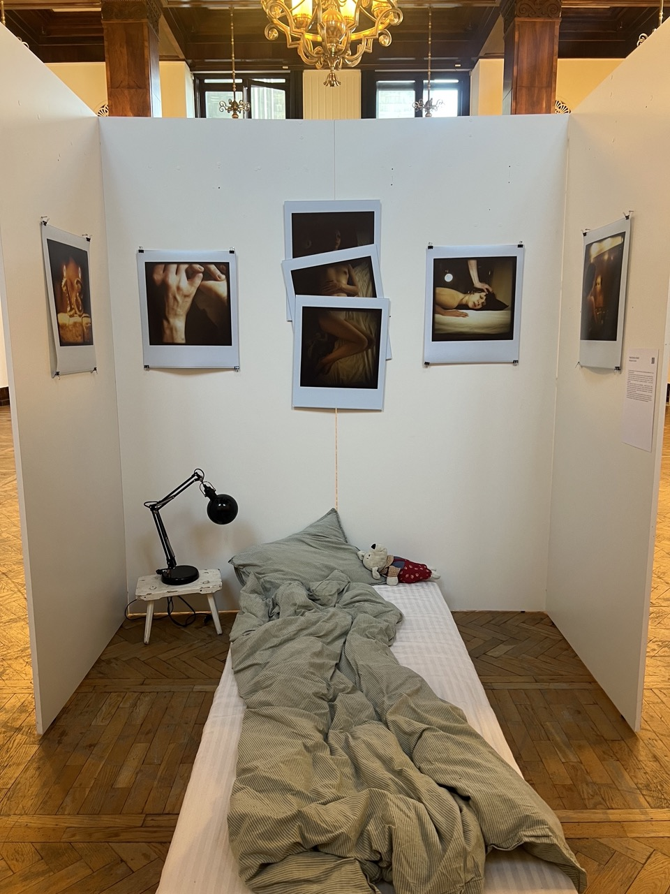
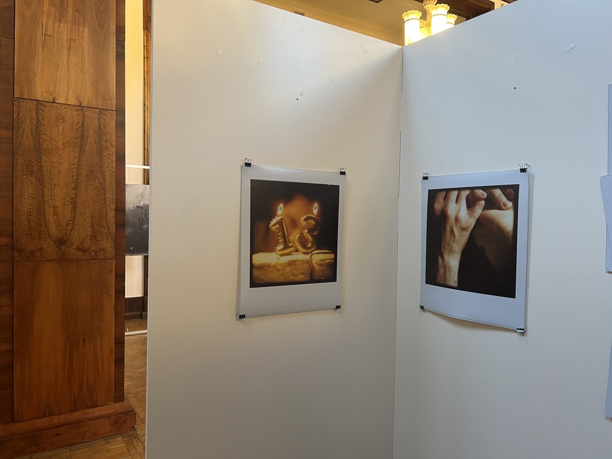
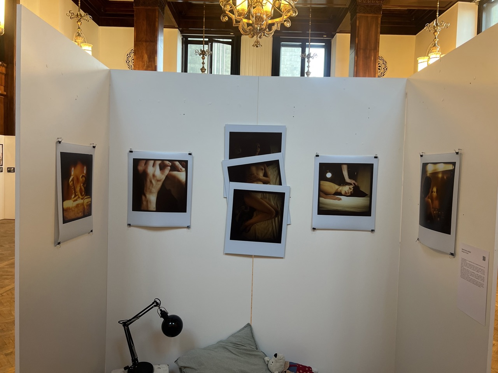
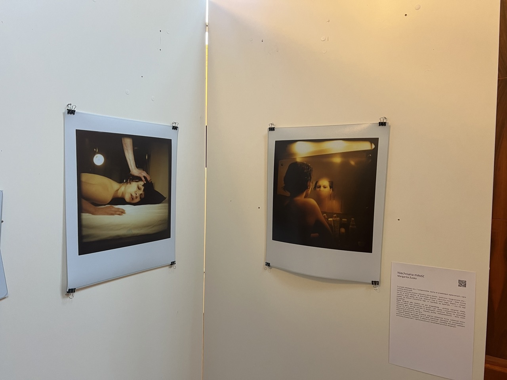

### Mimo powszechnej terapii wciąż boimy się mówić o emocjach. Młoda artystka Margarita Zusko pokazuje, jak sztuka może przełamywać to milczenie.

**Opowiedz o sobie.**

Od dziecka byłam bardzo ekspresyjną osobą, zawsze poszukiwałam sposobów na to, by wyrażać swoje odczucia wobec rzeczywistości. W 2015 roku, gdy miałam 11 lat, po raz pierwszy zetknęłam się z fotografią. Zaczęło się od tego, że rodzice zapisali mnie do domu kultury, gdzie zaczęłam uczęszczać na zajęcia z fotografii. Od tamtego czasu jest ona ze mną każdego dnia. Pochodzę z Białorusi i w 2021 przeprowadziłam się do Polski, gdzie w 2022 zaczęłam studia na Warszawskiej Szkole Filmowej w Warszawie. W 2025 roku obroniłam się i zrobiłam swoją pierwszą wystawę.

**Co w akcie tworzenia jest dla ciebie najważniejszą wartością?**

Przekaz. Moim zdaniem sztuka nie ma być tylko piękna i zachwycająca. Sztuka powinna być odzwierciedleniem osobowości. W mojej sztuce skupiam się na emocjach, traumach, przeżyciach, na ludziach, otoczeniu, przyrodzie – na wszystkim, co otacza człowieka od początku istnienia. I te tematy są zrozumiałe dla każdego. Chodzi mi o danie ludziom przestrzeni do zastanowienia się. To jest moja główne założenie artystyczne.

**Czy twoim zdaniem sztuka przetwarza trudne emocje? Dlaczego?**

Tak, jest mnóstwo przykładów. Bo sztuka jest sposobem wypowiedzi. O tym jest mój projekt – nie potrzebujesz słów, żeby powiedzieć, że coś jest nie tak w twoim życiu. Osoba, która chce zrozumieć twój ból, zobaczy to w twoich pracach. Muzyka, malarstwo, fotografia – każda forma sztuki to interpretacja myśli, a odbiorca może reinterpretować te uczucia w dowolny sposób. Według mnie najprostszy sposób, żeby zrozumieć człowieka, to zobaczyć jego sztukę. Możemy po tym poznać, w jakim momencie życia jest, co przeżył i jak patrzy na świat. Sztuka dla mnie jest też sposobem na leczenie ran – ludzie poprzez sztukę przerabiają traumy.

**Twój projekt _Niechciana miłość_ porusza bardzo trudny temat gwałtu. Dlaczego zdecydowałaś się, by o tym opowiedzieć?**

>Moim zdaniem sztuka nie ma być tylko piękna i zachwycająca. Sztuka powinna być odzwierciedlniem osobowości. W mojej sztuce skupiam się na emocjach, traumach, przeżyciach, na ludziach, otoczeniu, przyrodzie – na wszystkim, co otacza człowieka od początku istnienia.

Zawsze wychodzę z założenia, że jak coś robię i wiem, że to jest część mojego życia, to robię to na sto procent. Nie wiedziałam, czy to będzie moja pierwsza i ostatnia wystawa, czy początek kariery. Dlatego zdecydowałam się pójść na całość. Wybrałam temat, który tkwi we mnie i całej mojej egzystencji. To jest cząstka mnie, z którą potrzebowałam coś zrobić. I zrobiłam.

 

Zdjęcia to projekt artystyczny zawarty w 7 autoportretach, zrobionych metodą analogową. Głównym założeniem tej pracy jest refleksja na temat przemocy seksualnej. Ciąg zdjęć odzwierciedla historię trzynastoletniej dziewczyny, która jako dziecko, nieświadome i bezbronne, bez możliwości głosu – padło ofiarą gwałtu. Pierwsze zdjęcie wprowadza nas w świat dziecięcej beztroski. Poprzez kadry i nasycone kolory odczuwamy aurę dzieciństwa, która w pewnym momencie się rozsypuje. Kompozycja wystawy składa się z czterech pojedynczych zdjęć, których ciąg naruszony jest tryptykiem, wskazującym na bezsilność ofiary wobec sytuacji. Szczerość, naturalność i układ scenograficzny pozwala na otwarcie przestrzeni do kontemplacji nad sytuacją. Widz staje się ,,uczestnikiem” wydarzenia.

**Czy wchodzenie w trudne wspomnienia poprzez sztukę zmienia ich ciężar lub pomaga je modyfikować?**

Kiedy robiłam zdjęcia do projektu, nie byłam świadoma tego co robię. Wiedziałam, że temat jest poważny, ale to do mnie nie docierało. Jakby ten akt twórczy mnie całkowicie pochłonął; na tyle, że nie myślałam o emocjach, tylko o sztuce.

Dopiero gdy wydrukowałam zdjęcia, powiesiłam wystawę i ludzie zaczęli mówić o swoich odczuciach – dopiero wtedy zrozumiałam, co tak naprawdę zrobiłam.

Co zrobiłam wobec siebie i innych. Jaką myśl przekazałam. To wszystko było bardzo podświadome, a moje działania były intuicyjne. Zatem odpowiadając na twoje pytanie, to tak, jak najbardziej, ponieważ w żaden inny sposób, nie potrafiłam opowiedzieć o tym bez powracania do moich wspomnień, które były po prostu straszne. A tutaj mogłam to z siebie wylać, bez bólu.

Inaczej się nie da moim zdaniem. Na tym polega tworzenie sztuki, stajesz się takim swoim własnym medium, przez które przemawia twoja wrażliwość i emocje, i możesz nadać temu taki kształt, jaki chcesz. Potem patrzysz na to i po prostu to widzisz, i rozumiesz. A to jest coś wielkiego, zwłaszcza w kwestii traumy. Sam proces za to nie dawał mi żadnych emocji. Robiłam to, bo wiedziałam, że muszę. Chciałam, żeby to wyglądało tak, a nie inaczej. To wyszło ze mnie samo. Więc może nie zmodyfikowałam tych wspomnień, ale na pewno teraz jestem w stanie mówić o wszystkim. Bo to był dla mnie wręcz sakralny temat. A ja go wyciągnęłam z siebie i pokazałam ludziom. I teraz już niczego się nie boję.

Wyciągnęłam ten brud, strach, te emocje. Tą rzeczywistość, która wtedy była, i która bardzo mocno wpłynęła na mnie, jako na osobę – zrozumiałam, że okej, to się stało, i że mogę o tym mówić. Mogę mówić o wszystkim. Może nie słowami, bo tak jest ciężej, ale pokazałam to poprzez sztukę. Bo tak mi było łatwiej i lżej, ale to zrobiłam.

**Jak odróżniasz twórczą konfrontację od ponownego przeżywania bólu? Co jest dla ciebie granicą bezpieczeństwa?**

To nie jest tak, że przeżywam tą traumę na nowo. Bo ona nigdy nie zniknie. Każdy powrót do niej – to przeżywanie jej. Sęk w tym, jak o niej myślę. Ta trauma stała się częścią mojej osobowości. Więc to nie jest proces ,,przeżywania na nowo’’, a raczej akceptacja tego stanu. Więc, gdy się z tym konfrontuję, to ponownie przeżywam ten ból. Dla mnie nie ma granicy między tymi dwoma zależnościami, jedno wynika z drugiego. Po prostu wiem, że to było, że to jest we mnie i że to nie zniknie. To moja sprawa, jak i czy sobie z tym radzę. Powiedziałam do siebie samej: chcę sobie z tym poradzić i mogę to pokazać wprost, poprzez zdjęcia – coś, w czym poruszam się komfortowo i co znam. Nie słowami. Nie chodziło o to, żeby zrobić to ,,na spokojnie’’, jakby nic się nie stało, tylko naturalnie, tak jak potrafię i chcę. Kiedy opowiadam moją historię, staram się być emocjonalnie odcięta. Bo wiem, że to było, i że to się nie powtórzy. Moim jedynym sposobem na przepracowanie tych wspomnień jest mówienie o nich. Za każdym razem, gdy wracam do tego tematu – konfrontuję się z tą sytuacją na nowo i wybrałam tą drogę świadomie.

Założeniem mojej pracy było to, żeby człowiek patrząc na nią, znalazł się w mojej historii. Zrobiłam wszystko, co było możliwe finansowo i wystawienniczo, żeby wsadzić człowieka w sytuację, która jest moją traumą. By utożsamił się z moimi autoportretami i przeżył to razem ze mną. Żeby poczuł te same emocje. Bardzo możliwe, że emocjonalnie dokonałam pewnego rodzaju gwałtu na uczestnikach wystawy poprzez ten zabieg. Aczkolwiek istnieje mnóstwo prac, które są emocjonalnym gwałtem – zdjęcia z wojen, katastrof. Każde takie zdjęcie jest emocjonalnym gwałtem, ale ludzie tego tak nie nazywają. Także nieświadomie – na początku, lecz teraz już świadomie – zgwałciłam emocjonalnie każdego, kto patrzył na moje fotografie.

**Co było dla ciebie najtrudniejsze w wyjściu do ludzi z tak osobistą historią?**

Obecność moich rodziców na wystawie. To było najtrudniejsze. Nie chciałam, żeby wiedzieli. Nie chcę wywoływać u nich poczucia winy. Bo jeśli się dowiedzą, będą czuli się winni, a to nie była ich wina. Ja mogę dzielić się tym z każdym, tylko nie z nimi. Uważam, że nie jest im to potrzebne. Opowiadałam przy nich to tak, jakby to nie było o mnie: ,,To historia dziewczynki, która miała 13 lat”. Kiedy ich nie było – mówiłam prawdę. Opis pracy skonstruowałam w taki sposób, żeby nie było wiadomo, że to o mnie. Dałam ludziom możliwość interpretacji: czy to była moja historia, czy jakaś inna. Jedyne, co wskazywało na mnie, to fakt, że to są moje autoportrety.

>Wszyscy cierpimy, z jednego powodu czy drugiego, mamy tylko wybór, czy ten ból będziemy nosić w sobie, każdego dnia, podnosić się z nim, iść do pracy i starać się go dźwigać, czy go odpuścimy, czy to wodospadem łez, czy przelaniem go w twórczość, po prostu by wyrazić.

**Czy dzielenie się swoim doświadczeniem z odbiorcami przynosi ci ulgę?**

Nie wiem, czy taki temat może kiedykolwiek mieć coś wspólnego z ulgą. Gdy o tym opowiadam, czasem czuję się winna. Widzę smutek na twarzach ludzi. Widzę, jak przeżywają to ze mną. A jestem taką osobą, która bardzo odczuwa emocje innych. Ta sytuacja już mnie nie dotyka tak jak kiedyś. Gdy dzielę się tym z innymi i widzę ich reakcje, to nadal jest to dla mnie konfrontacją. Tylko teraz, gdy o tym myślę, to w takich chwilach nie chodzi o mnie. Tylko zaczynam skupiać się na tym, że może obciążam tą drugą osobę emocjonalnie. Dzielenie się tym jest trochę egoizmem z mojej strony, bo bez wypowiedzi to tkwiło by dalej we mnie, jednak kosztem tego, że inni czują mój ciężar, który w sobie noszę. To jest trochę takie błędne koło.

**Czy tworzenie daje ci poczucie kontroli nad własną historią? Czy raczej pozwala ją puścić?**

To bardzo dobre pytanie, muszę się nad tym zastanowić, ale bliżej mi do tego, że ją puszczam. To trochę jak z prowadzeniem dziennika, tylko dla mnie to są zdjęcia. W ten sposób się leczę, puszczam to z siebie i przetwarzam to w coś pięknego, z czym inni też mogą rezonować.

**Co czułaś, kiedy spojrzałaś na ukończony projekt?**

Właściwie to poczułam ulgę, gdy spojrzałam na skończony projekt. Poczułam ulgę, że byłam w stanie ująć to wszystko. Wszystkie emocje, cała trauma, zamknięta została w siedmiu zdjęciach. Byłam dumna z siebie. Wiedziałam, ile mnie to kosztowało, ile ciężkiej pracy w to włożyłam, i to co, dostałam w zamian dało mi ulgę. Usłyszałam wiele miłych słów, poczułam się wysłuchana, usłyszana, wsparta i dumna z siebie. Moja praca nie była na marne i to jest cudowne uczucie, mimo tego, jaką wartość w sobie nosi.

**Czy zauważyłaś kiedykolwiek przy tworzeniu moment ,,przemiany” – jakby twoja sztuka mówiła coś, czego sama wcześniej nie zauważyłaś, a pomogło ci to w życiu?**

Nie, czegoś takiego nie miałam. Z tego powodu, że jak wcześniej wspomniałam, ten proces twórczy był nie do końca świadomy. To terapia odegrała kluczową rolę w radzeniu sobie z traumą. Zatem w samym procesie nie dostrzegałam przemiany. Za to po zrobieniu wystawy dużo rzeczy do mnie doszło. Ten komfort wypowiedzi dużo dla mnie zmienił. Świadomość tego, jak wcześniej mówiłam, że mogę mówić o czym chcę, na różne sposoby. W tym wszystkim chodzi o jakiś rodzaj wypowiedzi, i to, jak zostanie on odebrany.

**Czy sądzisz, że ból może zostać przetransformowany przez sztukę tak, aby obrócić go w coś pięknego?**

Zdecydowanie. Gdy patrzę na moje zdjęcia, to są one piękne, estetyczne, trochę wyrafinowane. Bez kontekstu – są to dobre zdjęcia, są piękne. Ale to nie oznacza, że zdjęcia nie mogą wskazywać na ból. Gdy patrzę na obrazy, dostrzegam ból artystów, słyszę ich słowa. Oni opowiadali o swoim bólu i swoich przeżyciach poprzez sztukę. A teraz, gdy ludzie patrzą na te obrazy, myślą sobie: jaki piękny obraz… A to nie jest tak naprawdę obraz, który miał być piękny, on tylko tak wygląda. Tak naprawde to była ekspresja, pokazanie uczuć. Dajmy na przykład sztukę Basquiata. Cały świat się nim zachwyca, mówimy: wow, piękne, niesamowite. A to jest przecież obraz rozpaczy. Takich przykładów jest bardzo dużo. Poezja – tak samo, to przetwarzanie bólu w piękno. Pięknymi słowami opisujemy największy ból, dzięki czemu dociera to do dużej ilości ludzi. Całkowicie się z tym zgadzam, że możemy transformować ból w piękno. Dlatego sztuka jest taka niesamowita.

**Czy zdarzyło ci się, by proces twórczy odsłonił przed tobą więcej niż chciałaś?**

Dało mi to bardzo dużo świadomości, że to, co robię, ma sens. Wielokrotnie byłam w momencie, gdzie chciałam zrezygnować z pomysłu zostania fotografką. Myślałam: ,,Nie nadaję się’’, ,,Po co to jest, po nic’’, ,,No nie, jaka fotografia, jaki film, to w ogóle nie jest dla mnie’’. Ale za każdym razem moje życie, mój los, wszystko pchało mnie z powrotem, do aparatu. A ja wierzę w znaki, w to, że jest coś, co czuwa nad nami i pilnuje, żebyśmy byli tam, gdzie powinniśmy. Nie umiem z tym walczyć i nie chcę. Te myśli, które są, one nie pojawiają się znikąd. Nasze ciało, nasza głowa, wszystko daje ci sygnały, co jest dla ciebie dobre, a co nie. Tutaj pojawia się pytanie: czy słuchasz się siebie? Czy nie? W tym przypadku ja się siebie słucham, i po prostu to robię. I to tyle.

**Jak widzisz rolę wrażliwości w społecznym dialogu o traumie i przemocy?**

Każdy ma w sobie jakąś wrażliwość. Tak samo, jak każdy ma traumy, tylko przez społeczeństwo, w jakim żyjemy, nie chcemy o tym rozmawiać. Nasz świat wymaga on nas nieskończonej ilości wytrzymałości, mamy nie pokazywać słabości. Faceci nie mogą płakać, bo przecież „chłopaki nie płaczą”. Powiedzenia typu: przestań płakać, ogarnij się, uśmiechnij się, nikt nie chce oglądać cię w takim stanie, idź się schowaj – tak sobie mamy radzić z problemami. Zamknięci w domu, sami, ukryci przed światem. Wrażliwość odbierana jest jako ciężar. Przecież jesteśmy ludźmi, tu chodzi o spojrzenie na rzeczywistość, otwarcie się do ludzi wokół.

Uważam, że każdy jest wrażliwy, i czasem ludzie potrzebują, żeby ktoś pokazał im, że możesz być wrażliwy. Bo zobacz, ja jestem, czyli ty też możesz. Też posiadasz uczucia, i to jest jakaś rzecz, którą musisz w sobie rozwijać, bo inaczej cię to zabije. Jeżeli będziemy sobie powtarzać, że nie możesz płakać, nie możesz cierpieć, to cały ból zostanie w środku. I tak przez całe życie ten ciężar będzie się zwiększać, do momentu aż się z tym nie zetkniesz, i po prostu nie zaczniesz tego wyrażać przy bliskiej osobie, na ulicy. Wszyscy cierpimy, z jednego powodu czy drugiego, jednak mamy wybór – czy ten ból będziemy nosić w sobie, każdego dnia, podnosić się z nim, iść do pracy i starać się go dźwigać, czy go odpuścimy, czy to wodospadem łez, czy przelaniem go w twórczość.

**Czy twoja sztuka ma być sposobem na tworzenie przestrzeni, w której powstaje dialog o trudnych doświadczeniach?**

Tak, to było moje założenie, ale to ma być też dialog przede wszystkim z samym sobą. To jest fakt, przed którym stawiam widza, który on musi przyjąć do siebie, a jak to zostanie zinterpretowane lub odebrane – to już nie jest moja odpowiedzialność. Widz może sam się nad tym zastanowić, a może też się tym z kimś podzielić. Zatem, to jest bardziej o dawaniu przestrzeni do myślenia, i to jest główne założenie całej mojej twórczości.

**Czy twój projekt pomógł ci w przepracowaniu twojej traumy, i czy po zamknięciu wystawy poczułaś ulgę?**

W pewnym stopniu tak, ale to nie było kluczowe w przepracowywaniu traumy – kluczowa była terapia, a zrobienie wystawy dało mi pole do otwarcia dialogu między moimi traumami a rozmawianiu o nich z innymi.

**Czy czujesz, że ten rozdział został zamknięty?**

Nie, ale został przeze mnie zaakceptowany. Abym zamknęła ten rozdział, musi minąć jeszcze wiele czasu, lecz z pewnością jestem na dobrej drodze do tego; myślę, że akceptacja to najważniejszy krok w zamykaniu rozdziałów.

#####