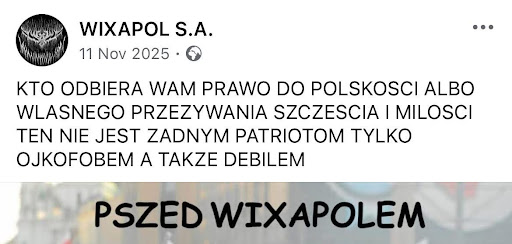
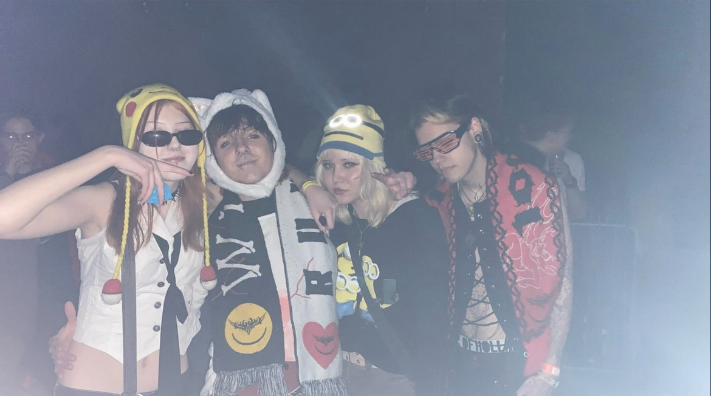
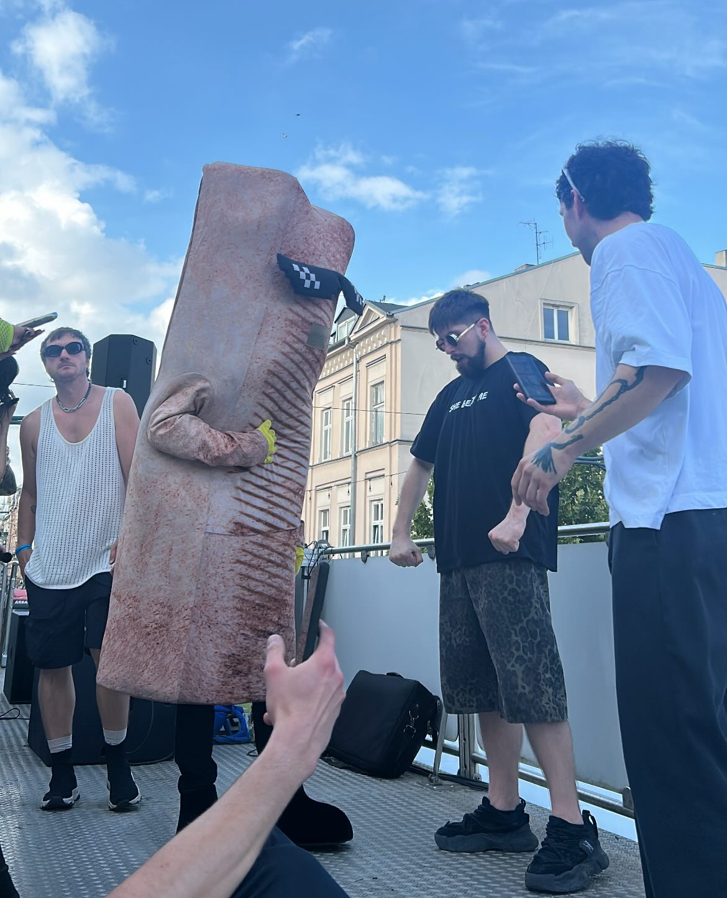

### Wixapol można potraktować jako przestrzeń szeroko rozumianej ulgi, wspólnotę, która rządzi się swoimi prawami. Partycypacja w niej to sposób na wyjście z rutyny, nie tylko codziennych oczekiwań i obowiązków, ale też standardów polskiego nocnego życia, którym bynajmniej nie rządzi, tylko merkantylizm i uprzedzenia.

,,Join our trip to this weird place
Back to nature where we can be
Faster and harder, louder and free” 

Powyższy fragment, zaczerpnięty z wydanego w 1996 roku utworu Back In The UK niemieckiej grupy Scooter, w pierwotnym zamierzeniu odnosi się do zdominowanej przez formułę free party [^1] brytyjskiej sceny muzyki elektronicznej. Mimo że od powstania utworu minęło 30 lat, zawarty w nim przekaz dobrze oddaje istotę Wixapolu, czyli kolektywu nie tylko zarządzających nim DJ-ów, Mikouaja Rejwa, Torrentz.eu i Sporty Spice, ale także wszystkich osób uczestniczących w jego wydarzeniach i społeczności. 

Pierwsza, oficjalnie zorganizowana pod szyldem wixapolu impreza odbyła się w 2014 roku, w nieistniejącym już klubie Parking Bar, jednak, jak mówią jego pomysłodawcy, sama idea kolektywu narodziła się w okolicach 2012 - 2013 roku, w sprzyjających awangardzie i kreatywnemu myśleniu okolicznościach afteru. Dwuczłonowa nazwa grupy bezpośrednio nawiązuje do potransformacyjnych, polskich firm epoki dzikiego kapitalizmu, w internecie prześmiewczo określanych mianem Januszex/Januszpol, oraz zapożyczonego z języka niemieckiego, pierwotnie wulgarnego słowa wixa, które w naszej kulturze [^2] już od lat 90 odnosi się do zabaw przy szybkiej muzyce elektronicznej. 
Wspomniana przeze mnie polska scena klubowa w opinii większości współczesnej “publiki” opiera się na organizowanych w wielkomiejskich lokalach, egzaltowanych wydarzeniach ze sztywną selekcją i znanymi nazwiskami w lineupie. Zjawisko imprez organizowanych w specyficznych dla mniejszych ośrodków (jednak o paradoksalnie pokaźnej pojemności) klubach, takich jak Protektor Uniejów, Omen Płośnica czy Ekwador Manieczki [^3], spychane jest na peryferyjny śmietnik historii “wiejskiego techno” i sprowadzane do niskolotnej, heretyczno-prymitywnej rozrywki dla prowincji. Jednak pomimo uprzedzenia “wyższych” sfer do wydarzeń tego typu, co weekend odwiedzają je tysiące osób. 

**Wixapol od swoich początków funkcjonuje jako inicjatywa o egalitarnym profilu, przez co rozumiem brak uprzedzenia nie tylko do konkretnych grup ludzi,** takich jak osoby odwiedzające miejsca pokroju wspomnianych wyżej lokali[^4], **ale także odejście od wszechobecnego w lukratywnych, elitarnych klubach ścisłego dresscode’u czy puryzmu gatunkowego.** Współczesny dyskurs kulturoznawczy zrywa z dychotomią kultura wysokakultura niska, traktując to rozróżnienie jako bezrefleksyjne i klasistowskie, a Bunt mas Gasseta [^5] jako tekst archaiczny. Pokrywa się to z wixapolską wersją kultury, która jest pozbawiona hierarchiczności, co dotyczy nie tylko wspomnianego odrzucenia dystynkcji stylu ubioru czy życia, ale też właściwej dla kolektywu komunikacji wizualnej i językowej.

W charakterystycznej, pozbawionej reguł ortografii i gramatyki wixapolskiej mowie można doszukać się inspiracji polskimi futurystami, szczególnie jednodniówką Nuż w bżuhu [^6], która stanowiła źródło tytułu jednej z imprez (Nuż w uhu); w celowych aberracjach polszczyzny, pojawiających się na social mediach i merchu, chodzi jednak głównie o modernizację i zabawę językiem, dopasowanie ich do pędu i ducha młodych, przychodzących na imprezy osób. Sztywne zasady gramatyczne kolektyw traktuje jako kolejne narzędzie dyscypliny, której chce się przeciwstawiać. Jako przykład zacytuję zeszłoroczny wpis wixapolu, zamieszczony w okolicach Narodowego Święta Niepodległości:

Przytoczony wyżej jeden z facebookowych postów poprzez zabawę językiem dobrze obrazuje politykę tożsamościową wixapolu. **W kontrze do zachodnich aspiracji wielu klubów i imprez,** tu mam na myśli zarówno sztywne imprezy, na których grane jest minimal techno, jak i inicjatywy kurczowo trzymające się holenderskiego gabberu, **Wixapol można określić jako ultra polski, oczywiście absolutnie nie w sensie krzewienia nacjonalizmu, tylko afirmatywnej postawy wobec tego, co polskie, ze wszystkimi urokami i słabościami, jakie ten epitet w sobie mieści.** Pomimo tego, że przychodząc na imprezy wiele osób decyduje się na odtwarzanie nostalgicznych, typowych dla chociażby thunderdome [^7] ortalionowych strojów, a w tracklistach często pojawiają się klasyki zagranicznych gatunków, nie brakuje wśród nich koszulek z Janem Pawłem II czy sampli z polskiego internetu. Wspomniane żarty z papieża funkcjonują na zasadzie anarchistycznego sprzeciwu wobec wpajanego młodym kultu postaci, której zjawisko jest im odległe, a majestat podważony przez związane z nią kontrowersje. 

W 2017 roku, na łamach “Gazety Wyborczej”, ukazał się tendencyjny artykuł o, zapewne mającym siać postrach wśród zatroskanych rodziców i niezaznajomionych z działaniami kolektywu czytelników, tytule: Kreska z telefonu. Narkotyki na Wixapolu, najbardziej pożądanych imprezach w Polsce. Jego autorka, Ewa Kaleta, wychodzi od z góry przyjętych założeń na temat odległego jej środowiska. Całą inicjatywę traktuje protekcjonalnie, sprowadzając ją do strefy bezrefleksyjnego przyzwolenia na swobodne zażywanie substancji psychoaktywnych. Dziennikarka przywołuje fikcyjny wywiad z założycielami Wixapolu, w którym mieli określić poruszanie tematu narkotyków na swoich imprezach jako “szukanie sensacji”, co, gdyby nie patetyczny charakter całego materiału, uznałabym za autoironię. Nonszalanckie podejście kolektywu do wspomnianego zagadnienia podważa jego wieloletnia współpraca ze Społeczną Inicjatywą Narkopolityki [^8], organizacją zajmującą się szeroko pojętym party-workingiem i rozpowszechnianiem wiedzy na temat bezpiecznego użytkowania substancji psychoaktywnych. Wbrew tezie Kalety,  wyraźnie oznaczone stanowiska wolontariuszy wyszkolonych w kierunku postępowania z odurzonymi uczestnikami imprezy nie zachęcają ich do narkotyzowania się, a redukują szkody wśród osób nietrzeźwych i uświadamiają wszystkie inne o skutkach zażywania substancji psychoaktywnych. Akceptacja niemożliwego do wyeliminowania problemu i działanie w kierunku zminimalizowania wynikających z niego strat, w kontrze do, powszechnej na większości polskich imprez, ignorancji i wygodnego dla wizerunku “zamiatania pod dywan” odnosi wymierne, pozytywne skutki.

Odniesienie słowa ulga do działalności Wixapolu wzbogaca jego encyklopedyczną definicję o nowy kontekst. Ulga przestaje być jedynie przeciwieństwem napięcia, na potrzeby tekstu rozumianego przeze mnie jako toksyczna kultura sporej części polskich imprez z muzyką elektroniczną, a zaczyna określać nową jakość klubowania opartą nie tylko na egalitarności, ale przede wszystkim zabawie, która w końcu powinna być fundamentem wspomnianych inicjatyw. 

[^1]: Z ang. “wolna impreza”; free w nazwie odnosi się przede wszystkim do wolnego powietrza, jednak wydarzenia w tej formule są też pozbawione biletowanego wstępu, dresscodeu i panujących w zamkniętych klubach sztywnych zasad i selekcji.

[^2]: Tu: polskiej.

[^3]: Ważny jako zjawisko kulturowe, jednak odbiegający kontekstowo od pozostałych dwóch, przytoczonych klubów przykład, a to z powodu większej legitymizacji i uznania wśród “elitarnych” środowisk.

[^4]: Wixapol w przeszłości organizował wydarzenia takie jak Hard Techno Mission w Protectorze Uniejów, oraz zapraszał na swoje imprezy legendy sceny tzw. “manieczek” takie jak, świętej pamięci, DJ Hazel, czy DJ Noiserr.

[^5]: W Buncie mas José Ortega y Gasset wskazuje, że masowy człowiek odrzuca wartości kultury wysokiej, dążąc do ujednolicenia i uproszczenia życia. Bunt mas prowadzi więc do zaniku elitarnej, twórczej kultury wysokiej na rzecz kultury niskiej, masowej, łatwej i pozbawionej ambicji intelektualnych.

[^6]: Polscy futuryści bawili się językiem poprzez rozbijanie składni, fonetyczny zapis słów, neologizmy i świadome łamanie norm ortograficznych. 

[^7]: Thunderdome to organizowany od 1992 roku holenderski cykl imprez i festiwali muzycznych wydający swoje składanki (głównie z gatunku hardcore) i charakteryzujący się odpowiadającą niderlandzkim rejwom estetyką.

[^8]: Wcześniej: Studencka Inicjatywa Narkopolityki. 

