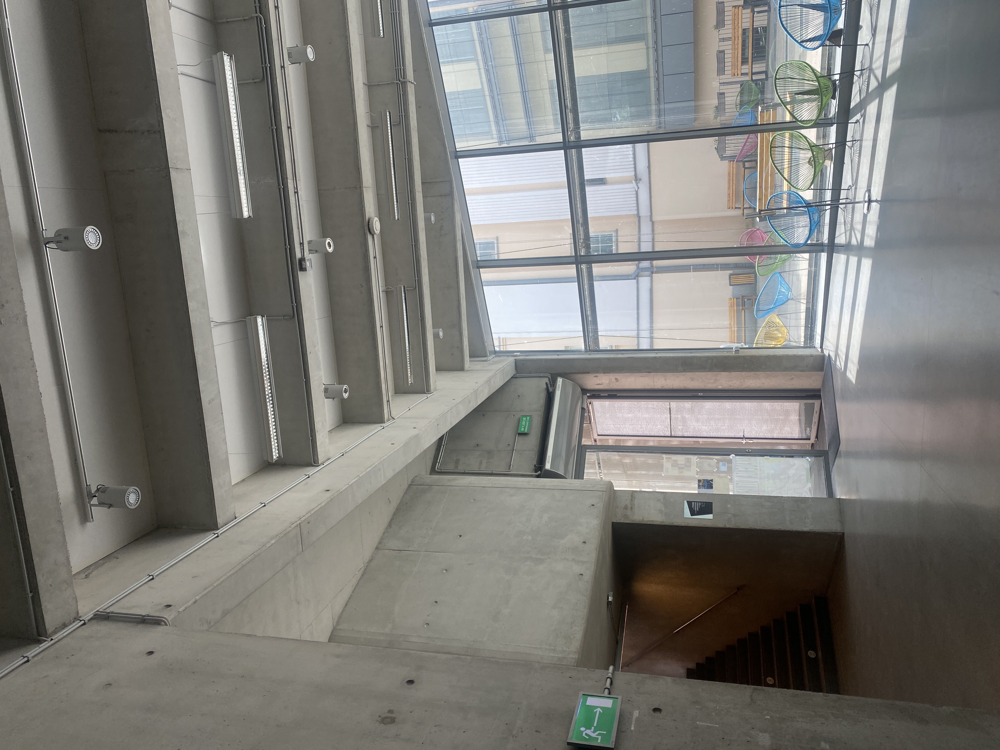

### Szkoła naszym domem. Tyle tylko, że domy bywają różne: mogą być zarówno przytulne i harmonijne, jak i opresyjne. Brak infrastruktury wspierającej długie przebywanie w budynku ASP przy Wybrzeżu Kościuszkowskim jest powszechnym problemem, a średnia ocena tej infrastruktury wynosi 1,7 w pięciostopniowej skali.
 

Przeciętny student w Polsce spędza na uczelni około dwudziestu godzin tygodniowo[^1] –  jest to czas, który poświęca się nie tylko na naukę, lecz także na budowanie relacji społecznych, wymianę pomysłów oraz rozwój twórczy. W tym procesie na studenta wpływa wielka ilość czynników, a jednym z nich jest architektura i wnętrza budynku uczelni. W XXI wieku stwierdzenie, że architektura ma wielki wpływ na psychikę osób w niej przebywających, nie wymaga szczególnego wyjaśnienia – ludzkość zdawała sobie z tego sprawę od starożytności, choć pierwsze badania zyskały na znaczeniu dopiero w XIX i XX wieku. Le Corbusier zrewolucjonizował nowoczesne budownictwo poprzez zastosowanie filozofii wpływu mieszkalnictwa na jakość życia ludzi – wierzył w to, że architektura przede wszystkim ma służyć ludziom, nie na odwrót. 
Sześćdziesiąt lat po śmierci architekta jego filozofia i rewolucyjne podejście do budowania nadal są żywe. Zarazem definicje piękna i komfortu w architekturze uległy wielkim zmianom. 
> Pokolenie „Z” docenia przede wszystkim autentyczność i przytulność w designie[^2] – młodzi w większości mają dość bezdusznych, minimalistycznych klocków, choć akurat takie budynki są powszechnie uznawane za nowoczesne i „młodzieżowe”. 

Świetnym tego przykładem jest nowy budynek Akademii Sztuk Pięknych w Warszawie przy Wybrzeżu Kościuszkowskim, który został zaprojektowany i zbudowany w 2014 roku przez firmę Jems Architekci[^3]. Od tego momentu kampus służy jako przestrzeń edukacyjna, a także wystawiennicza dla studentów, pracowników i gości uczelni.
Jednak mimo dobrego wyposażenia i nowoczesnego wyglądu powstałego gmachu, 
> przechodząc korytarzami można często usłyszeć skargi na szarość, brak światła i miejsc do siedzenia. 

Na tym konflikcie estetyki i komfortu polega główna sprzeczność kampusu – uważany przez gości i rzeczoznawców za stylowy budynek, jest często niewygodny, a nawet przytłaczający wobec swoich głównych użytkowników..  
W celu analizy tego problemu, zostały zebrane i przeanalizowane ankiety od 30 osób studenckich z różnych wydziałów – zarówno tych, które przybywają na wydziałach przy Wybrzeżu Kościuszkowskim codziennie, jak i tych, co bywają w tym budynku raz na tydzień, a nawet rzadziej[^4]. Rozdzielenie to jest istotne, ponieważ relacja częstotliwości przebywania w budynku a opinia na temat wnętrz bezpośrednio korelują z wynikami. Mianowicie z przeanalizowanych ankiet wynika przede wszystkim to, że im rzadziej osoba studencka pojawia się w nowym budynku, tym lepiej ocenia estetykę, układ przestrzeni i infrastrukturę kampusu. 58 procent osób z wydziałów Badań Artystycznych i Studiów Kuratorskich oraz Scenografii, stacjonujących się w tym budynku na co dzień, wskazały na to, że kolorystyka wnętrz, która jest przeważnie szara, jest według nich depresyjna i przytłaczająca. W tej grupie dominują odpowiedzi wskazujące na negatywny wpływ surowych, betonowych ścian na komfort psychiczny. 
> Część osób uważa, że budynek przypomina bunkier, więzienie albo piwnicę, a przyzwyczajenie się do niego zajęło miesiące. 

Równie negatywne uczucia ma jedynie 15 procent osób z pozostałych wydziałów, które nie bywają w budynku codziennie, natomiast 85 procent z tejże grupy wskazało na to, że kolorystyka jest neutralna, uspakajająca, a nawet atrakcyjna. W tej grupie negatywne opinie pojawiają się znacznie rzadziej i mają mniejsze napięcie emocjonalne. 

Bardzo bliską kolorystyce wnętrz i równie kontrowersyjną kwestią jest dostęp do światła dziennego. 85 procent osób z wydziałów najwięcej przybywających na Wybrzeżu Kościuszkowskim wskazało na niedobór światła dziennego – szczególnie problematycznym okazało się pierwsze piętro, gdzie korytarze są niemal całkowicie pozbawione okien. Natomiast w grupie osób przebywających tu sporadycznie, znacznie częściej pojawiają się opinie neutralne czy pozytywne, a problem dostrzega jedynie 58 procent respondentów. Tymczasem światło i kolorystyka bezpośrednio wpływają na samopoczucie psychiczne, kreatywność, uwagę i nastrój[^5]. Widać to chociażby po odpowiedziach osób studiujących w budynku na co dzień. Wśród nich częste są deklaracje negatywnego wpływu przestrzeni na proces twórczy oraz zmęczenia psychicznego po dniu spędzonym w ścianach budynku – osoby studenckie przyznają się, że budynek często demotywuje i nie sprzyja regeneracji pomiędzy zajęciami, co z kolei jest następnym istotnym wyzwaniem. Brak infrastruktury wspierającej długie przebywanie na uczelni był zauważony przez każdą osobę, która wypełniła ankietę, a średnia ocena infrastruktury wynosi 1,7 w pięciostopniowej skali. Niemal każdy wspomniał o ostrym problemie braku miejsc do siedzenia pomiędzy zajęciami. W zależności od dnia na korytarzu pierwszego piętra jest średnio od dziesięciu do piętnastu miejsc do siedzenia – jest to nieadekwatna ilość do liczby osób studenckich codziennie przybywających tu na lektoraty, laboratoria, konserwatoria, seminaria i inne zajęcia. Rozwiązaniem dla studiujących jest siedzenie na podłodze, co niestety nie sprzyja ani regeneracji, ani integracji w wolnym czasie. 

W obu grupach, zwłaszcza wśród osób studiujących wzornictwo i architekturę wnętrz, powtarzają się uwagi dotyczące problematycznych kranów w łazienkach, które przy próbie umycia rąk mocno rozbryzgują wodę na odzież, a także nie pozwalają regulować temperatury wody, co skutkuje brakiem bezpłatnej wody pitnej na kampusie.

Nie patrząc na to, że problem zauważają wszyscy, różnica między dwiema grupami ujawnia się w intensywności odczuwania tych braków. Dla osób studenckich przychodzących do budynku rzadziej brak dogodnej infrastruktury jest często uciążliwy, lecz nie tak krytyczny, jak dla tych, które przebywają tu codziennie i widać to po zadeklarowanych uwagach. Tylko 8 procent respondentów z innych wydziałów niż WBASK i Scenografia doświadczyło problemu braku stołówki i kuchni, w której można przygotować oraz zjeść posiłek przy stole i z przyjemnością odpocząć. Po wielogodzinnych zajęciach i długich przerwach między nimi brak miejsca, w którym można normalnie zjeść i odzyskać energię jest opisywany jako frustrujący, a nawet upokarzający, ponieważ jedzenie posiłku często odbywa się na podłodze korytarza albo w biegu, a strefa mikrofali jest krytycznie opisywana jako nieprzyjemna i ciasna komórka, która „jest jakimś żartem”. 
W uwagach osób studiujących na wydziałach stacjonujących się na nowym kampusie krytyka infrastruktury także często pojawia się w połączeniu z krytyką estetyki budynku: korytarze są uznawane za zbyt puste i szare, zniechęcające do przebywania w przestrzeniach wspólnych i integracji studenckiej. Najczęstszą w związku z tym propozycją zmiany jest wprowadzenie roślin w salach i przestrzeniach wspólnych oraz umieszczenie mebli na korytarzach dla odpoczynku i integracji – te propozycje wybrzmiewały równie często tak w pierwszej, jak i w drugiej grupie badawczej: „Więcej miejsc do siedzenia na korytarzach. Myślę, że dodatek roślin gdzie się da by pomógł zwalczyć nieprzyjemną atmosferę w budynku”. Taka propozycja wydaje się być najbardziej optymalną i możliwą do spełnienia: nie zakłada wyburzenia czy zmiany koloru ścian, nie przeczy ogólnej estetyce kampusu i może stać się świetnym kompromisem między osobami studenckimi a kierownikiem obiektu i władzami uczelni.
Warto jednak zauważyć i pozytywnie ocenione właściwości nowego kampusu Akademii Sztuk Pięknych. Nie patrząc na wskazane problemy związane z kolorystyką, licznymi niedogodnościami i niedoborem światła dziennego, według wyników większość osób studenckich czuje się w tym budynku swobodnie i „bezpiecznie emocjonalnie”. W odpowiedziach nie pojawiły się ani sygnały zagrożenia, ani niepokoju. I chociaż w większym stopniu ten wskaźnik zależy od ludzi tworzących społeczność akademii, architektura budynku niewątpliwie odgrywa tu niewielką, ale istotną rolę. Kolejnym aspektem, który okazał się najlepiej ocenionym przez studentów jest dostępność budynku: winda dostępna od poziomu wejścia, szerokie drzwi, brak barier, toalety bez sztywnych oznaczeń genderowych – wszystkie te aspekty sprawiają, że kampus jest postrzegany jako dostępny dla prawie wszystkich osób studenckich, gości i pracowników. 

Warto zauważyć, że te pozytywne aspekty nie neutralizują krytycznych i negatywnych ocen dotyczących kolorystyki i infrastruktury, ale stanowią istotny kontrapunkt dla dominującej narracji niezadowolenia. Pokazują one, że problem nowego budynku Akademii Sztuk Pięknych nie polega na całkowitej dysfunkcji, lecz na wyraźnej dysproporcji pomiędzy technicznym wyposażeniem i aspiracjami estetycznymi a jego rzeczywistą możliwością do wspierania codziennego życia studenckiego. A wyniki ankiet jasno pokazują, że skala frustracji jest bezpośrednio zależna od czasu ekspozycji na ten budynek – ten fakt tłumaczy sprzeczność między niezadowoleniem osób studenckich a równoczesnym zachwytem tym budynkiem przez fachowców i gości. Ta różnica podkreśla, jak istotne jest projektowanie budynku uczelni opierając się nie tylko na aspiracjach estetycznych, lecz także na rzeczywistym doświadczeniu i potrzebach osób studenckich. 

##### Bibliografia:
* Dewey Hayden, [_The Effect of Contemporary Art on Fashion in Generation Z_, University of Arkansas, 2024 r., s. 8](https://scholarworks.uark.edu/ampduht/32/)
* [Jems Architekci, wybrane prace.](https://jems.pl/projekty/wybrane-prace/asp.html.)
* Olszewska Natalia, [_Zdrowie zaczyna się od przestrzeni. Raport 2025_, s. 21-22.](https://oknoplast.com.pl/broszury/A/Raport-2025-Oknoplast-Wellness-Design.pdf) 
* [_Społeczne i ekonomiczne warunki życia studentów w Polsce na tle innych krajów europejskich. Raport z badania Eurostudent 2022_, s. 82.](https://www.gov.pl/attachment/73bbbcd8-e89d-4f03-863d-4743d5d677a6) 

[^1]:  _Społeczne i ekonomiczne warunki życia studentów w Polsce na tle innych krajów europejskich. Raport z badania Eurostudent 2024_, s. 82.

[^2]: Hayden Dewey, _The Effect of Contemporary Art on Fashion in Generation Z_, University of Arkansas, s. 8.

[^3]: [Jems Architekci, wybrane prace.](https://jems.pl/projekty/wybrane-prace/asp.html.)

[^4]: Wszystkie cytowane wypowiedzi oraz opinie pochodzą z elektronicznych ankiet anonimowych, respondentami są wyłącznie osoby studenckie z ASP w Warszawie. Łącznie zebrałam 30 ankiet.

[^5]: Natalia Olszewska, _Zdrowie zaczyna się od przestrzeni. Raport 2025_, s. 21–22.

