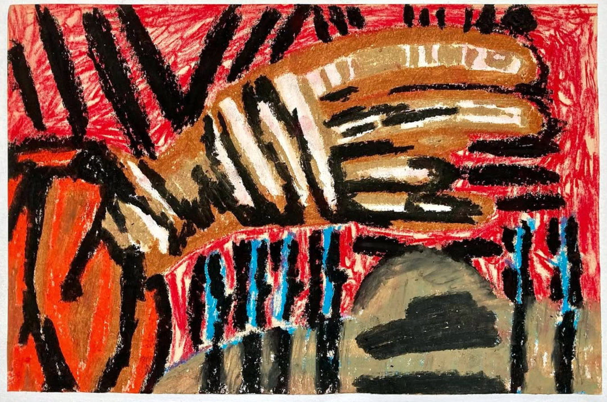
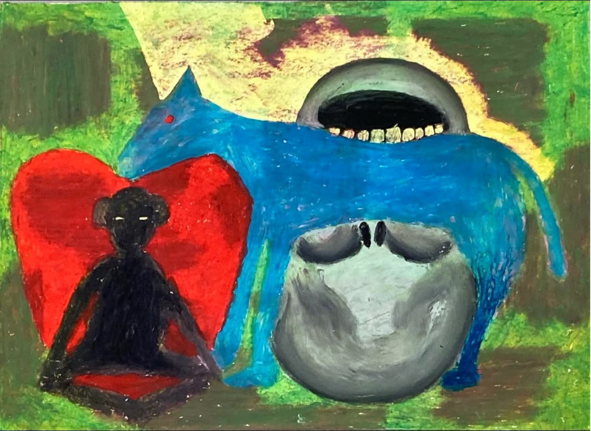
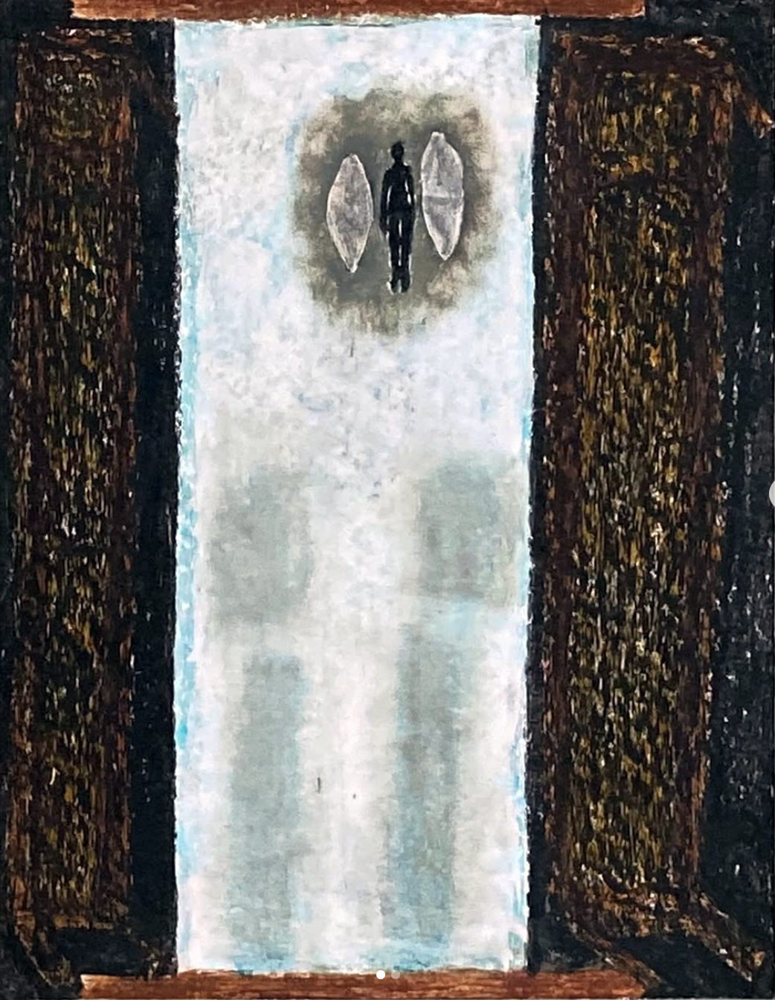

### Jung stosował metody artystyczne, by poprzez tworzenie mandali tworzyć mapy psychiki ludzkiej, w których pojawiały się głęboko schowane w niej problemy. Tak samo robi Gerben Koldijk.

Główną postacią w pracach Gerbena Koldijka jest jego ojciec. Jak pisze w opisach rysunków, przed śmiercią jego tata zaczął opowiadać i zwierzać mu się ze swojego życia. By to przepracować, zaczął rysować jego opowieści. Najważniejsza wiązała się ze wstydem za seksualność, którą ojciec ukrywał przed nim całe życie.

Od paru miesięcy obserwuję konto na Instagramie, które zdaje się funkcjonować jako archiwum rysunków użytkownika o pseudonimie „drawings_for_my_dad”. Za kontem stoi Gerben Koldijk, który poza opisami rysunków nie dzieli się niczym więcej na temat swojego życia, nigdzie nie ma jego zdjęć, informacji kim jest ani skąd pochodzi. Opisy rysunków skupiają się na jego stanie emocjonalnym i jego relacji ze swoim ojcem, co jest też główną tematyką jego dzieł. Postów znajduje się już 705 i ta liczba cały czas rośnie. Konto obserwuje 5 tysięcy osób i wiele ludzi zdaje się śledzić z zainteresowaniem twórczość Koldijka ukazującą proces żałoby.

W opisie swojego profilu Koldijk zdawkowo pisze: „Te rysunki są o mnie i moim tacie. Teraz kiedy go nie ma, mają służyć pomocą w przepracowaniu jego utraty i wyrażenia mojej miłości dla niego”.

W wyróżnionych zarchiwizowanych relacjach poszczególne rysunki pogrupowane są wedle rozmaitych kategorii, jak „wstyd”, „dorastanie”, „diagramy”, „portale”, „mroczne fantazje”, „przodkowie” itp. 

Główne medium, w jakim Koldijk się porusza, to pastele olejne na papierze, czasem z użyciem farby plakatowej. Wykorzystywane przez niego motywy wpisują się w Jungowskie terminy i symbole. W psychoanalizie Carla Gustava Junga uwagę skupia się na podświadomej części psychiki, w której stłamszone są emocje i przeżycia wypychane przez świadomość z powodu najczęściej wstydu bądź związku z jakimś traumatycznym wydarzeniem. Przepracowujemy je wtedy nieświadomie w snach i innych mniej świadomych stanach. Jung stosował metody artystyczne, jak rysowanie i malowanie, by poprzez tworzenie mandal tworzyć mapy psychiki ludzkiej, w których pojawiały się głęboko schowane w niej problemy. Obrazy Koldijka są bardzo hipnotyczne; wykorzystując wiele kolorów układających się w kształty mandal i labiryntów jaźni, przypominają kalejdoskopy jego psychiki. Głównym bohaterem jego prac jest jego ojciec, wykonujący czynności kojarzone ze wstydem związanym z ukrywaniem pragnień przed innymi; poza tym pojawia się tam wiele przedmiotów symbolizujących ojca Koldijka. Jak pisze w opisach rysunków, przed śmiercią jego tata zaczął opowiadać i zwierzać mu się ze swojego życia. Koldijk, by to przepracować, zaczął rysować opowieści ojca. Najważniejsza wiązała się ze wstydem za, przedstawiające jego wstyd za swoją seksualność, którą czuł że ojciec ukrywał przed nim całe życie. Najczęściej w opisach pod postami artysta powtarza:

Niedawno mój ojciec zmarł w wieku 90 lat.

Ostatnie trzy lata swojego życia spędził w domu opieki. Regularnie go tam odwiedzałem i prowadziliśmy ze sobą ciepłe, szczere rozmowy. Bez żadnych oporów ojciec opowiadał mi o swoim życiu. Wywarło to na mnie ogromny wpływ.
Jako sposób na poradzenie sobie z tym doświadczeniem zacząłem tworzyć rysunki. Niektóre z nich przedstawiają sceny z życia mojego taty. W innych próbuję wyobrazić sobie, jak musiał się czuć w przełomowych momentach swojego życia. Oczywiście moje własne emocje mają duży wpływ na to, jak te rysunki wyglądają.

Dzięki temu nie są one tylko o nim, ale także o mnie. Jesteśmy ze sobą na zawsze połączeni.

Kocham Cię, Tato!

Rysunki są ułożone chronologicznie. Często tworzę ich kilka, jeden po drugim, ale nie oznacza to, że trzymam się jednego, stałego planu. Raczej rysuję, kierując się emocjami jako wskazówką.

Mimo to pojawia się kilka motywów, które nieustannie powracają: zmagania mojego ojca z własną orientacją seksualną oraz jego poszukiwanie sensu i duchowości. A także rzeczy, które kochał robić: żeglowanie, granie na fortepianie i wędrówki po górach.
Rysunki można oglądać osobno, ale dla mnie tworzą one jedno wielkie dzieło, w którym mój ojciec i ja pojawiamy się w sposób kalejdoskopowy. Mam nadzieję, że rozumiecie, co mam na myśli.

By wniknąć głębiej w praktykę artystyczno-terapeutyczą Gerbena Koldijka, udało mi się zrobić mi nim wywiad. Poza dzieleniem się swoją sztuką, Koldijk raczej woli trzymać resztę jego życia jako sprawę prywatną, ale zgodził się na chwilę rozmowy.

Tak naprawdę jako artysta działa już od dłuższego czasu, ale przybrało to formę terpeutyczną dopiero po śmierci jego ojca: „Jestem zawodowym artystą od 30 lat. Przez długi czas tworzyłem duże abstrakcyjne obrazy geometryczne. Kiedy zmarł mój ojciec, przestałem to robić na czas nieokreślony. Chciałem zrobić coś z uczuciami żałoby i mojej miłości. Spontanicznie sięgnąłem po papier i po prostu zacząłem tworzyć. Na początku używałem różnych materiałów, ale pastele olejne szybko stały się moim ulubionym medium”.

Koldijk z początku na rysunki nie patrzył więc artystycznie, ale czysto terpeutycznie: „Kiedy tworzyłem duże obrazy, chciałem, żeby były sztuką. Przy tych rysunkach to mnie nie interesuje. Chcę, żeby wyrażały to, co czuję”. 

Pierwszy rysunek datuje na 27 października 2022 roku. Jest narysowany w bardzo chaotycznym, ekspresjonistycznym stylu, bez szczegółowego nakreślania konkretnych kształtów. Pojawia się na nim wiele kolorów i grubych, pewnych siebie pociągnięć ręką, tworzących przecinające się linię. W podpisie autor mówi: „Rzadko mam jasny pomysł, co narysować. Po prostu zaczynam i myślę o czymś, co powiedział mi mój ojciec. Kocham Cię, tato!”.

W większości prac widać geometryczne spojrzenie na formę, które pewnie wywodzi się z wcześniejszego stylu tworzenia Koldijka. Bardzo często poprzez kolory zarysowują się abstrakcje umieszczone w kołach i kwadratach. Sporadycznie pojawiają się na nich teksty albo dokładniejsze detale. Podczas rozmowy Koldijk mówił: „Rysunki są czysto intuicyjne. Niczego nie planuję z wyprzedzeniem. Nie oznacza to, że czasem nie mam jakiegoś pomysłu lub odczucia, które staje się punktem wyjścia. Często jednak rysunek szybko zaczyna podążać własnym torem. I lubię za tym iść. Z mojego doświadczenia wynika, że rysunek, który jest zbyt wykalkulowany, nigdy nie wychodzi naprawdę dobrze”.

Koldijk zgadza się na psychoanalityczną interpretację swoich prac i sam zauważa obecność Jungowskich archetypów. Jung poprzez lata swojej praktyki wytypował społeczne wzorce umiejscowione w zbiorowej podświadomości. Bardzo mocnym archetypem jest m.in. archetyp ojca, który symbolizuje autorytet, bezpieczeństwo i siłę. Gdy takie archetypy zostają z jakiegoś powodu zaburzone, Jung proponował arteterapię. „Jednak w rysunkach silnie obecne są archetypy. Światło i ciemność, góra i dół, wszystko to ma głębsze znaczenia duchowe. Jung pisał o tym obszernie. I oczywiście w rysunkach bardzo wyraźnie pojawia się figura ojca (wraz z dzieckiem, czyli mną). Myślę, że jest tam znacznie więcej archetypów, ale nie poszukuję ich świadomie. Po prostu pojawiają się naturalnie”. Bardziej od mandali woli nazywać je kaloidoskopami, które w szerszym spojrzeniu zaczynają łączyć się w jedność, historię relacji ojciec-syn, dorastania i poznawania siebie. Czasem zamiast postaci ludzkich pojawiają się zwierzęta: Koldijk jako koń, a jego ojciec jako małpa; bardzo często rysuje też oczy rozglądające się wokoło albo figury wykonujące czynności seksualne. Poprzez formowanie wszystkich motywów w geometrycznych kształtach, przeglądając po kolei jego posty na Instagramie, można się poczuć jakby rozwijał się przed nami coraz dłuższy i głębszy tunel psychiki autora, który cały czas odkrywa przed nami nowe warstwy. Nawiązując do terapeutycznej metody Junga, by przepracować traumy, często trzeba w jakiś sposób dostać się do mniej świadomej części naszego Ja. Jest to możliwe na przykład podczas intuicyjnego tworzenia, jak w przypadku Koldijka „Rysowanie jest rzeczywiście dobrym sposobem radzenia sobie z tym. Podczas rysowania, jak już piszesz, wchodzę w szczególny stan świadomości. Trans to duże słowo, ale właśnie tak to odczuwam. Można to też nazwać półświadomością”.

Z czasem Koldijk zaczął doceniać walor artystyczny rysunków. „Pomysł, aby podzielić się rysunkami, wyszedł od zaprzyjaźnionego artysty. Początkowo postrzegałem je jako terapeutyczne i ściśle prywatne. Ta osoba przekonała mnie jednak o ich wartości artystycznej… Kiedy publikuję rysunki na Instagramie, odczuwam pewien wstyd, ale jednocześnie otrzymuję wiele życzliwych wiadomości od osób, które doceniają te prace. Często są to ludzie, którzy również stracili kogoś bliskiego, albo osoby, którym podoba się to, że rysunki są tak surowe (i nie próbują udawać „sztuki wysokiej”)”.

Wygląda na to, że Koldijk coraz bardziej otwiera się na dzielenie się swoją twórczością i zapowiada nawet organizację swojej wystawy w tym roku, co na pewno będzie ciekawym wydarzeniem. 

