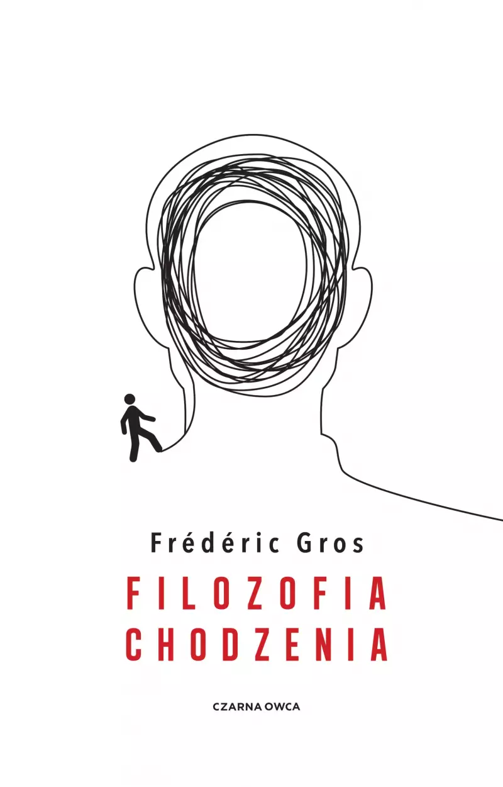

### Nietzsche stworzył swoje najważniejsze dzieła w trakcie wędrówek po górskich szlakach. Gandhi w ramach polityki biernego oporu organizował wielodniowe, pokojowe marsze. Thoreau odbywał leśne przechadzki, a Kant codziennie spacerował po Królewcu. Niezależnie od różnic między epokami, w których żyli, czy dzielących ich odległości geograficznych, wszystkich zajmowało chodzenie. Postrzegali je jako akt filozoficzny i doświadczenie duchowe, któremu poświęcili wiele analiz. O wędrujących myślicielach Frédéric Gros pisze w książce *Filozofia chodzenia*. 

Zapewne każdy słyszał o dobroczynnym wpływie spacerowania na organizm. Chodzenie na świeżym powietrzu zwiększa odporność, obniża stres, powoduje szybszą cyrkulację krwi, co zwiększa dotlenienie mięśni i organów. Badania wykazały, że ćwiczenie lub regularne spacerowanie nie tylko stabilizują nastrój i ułatwiają skupienie. W trakcie wysiłku tlenowego wydzielany jest neutroficzny czynnik pochodzenia mózgowego, białko przyspieszające neurogenezę (proces tworzenia nowych, w pełni funkcjonalnych neuronów) – szczególnie w hipokampie lub innych ośrodkach naszego mózgu odpowiedzialnych za pamięć i uczenie się. Z kolei psychologowie zauważają, że tempo spaceru, jakie sobie nadajemy może często wynikać ze stanu emocjonalnego w jakim się znajdujemy. Możemy też starać się regulować nasz nastrój za pomocą dobrania odpowiedniego rytmu stawianych przez nas kroków. Gdy chodzimy, wytwarza się zatem zależność między naszym procesem myślowym a ruchem ciała (i na odwrót) – następuje wewnętrzny dialog. 

W 2014 roku Marily Oppezzo i Daniel Schwartz, naukowcy z Uniwersytetu Stanforda, przeprowadzili serię eksperymentów, w wyniku których wykazali pozytywny wpływ chodzenia na proces myślenia kreatywnego. W ramach badań 176 uczestników miało za zadanie wymyślić nietypowe wykorzystanie otrzymanych obiektów użytku codziennego. Wszyscy uczestnicy podejmowali się rozwiązań na cztery sposoby: chodząc na bieżni lub siedząc w pomieszczeniu oraz spacerując lub siedząc na zewnątrz. Okazało się, że w trakcie chodzenia ilość propozycji na nowe zastosowanie otrzymanych obiektów wzrosła o 60% w stosunku do wykonywania zadań w pozycji siedzącej. Ku zdziwieniu badaczy, którzy zakładali, że osoby spacerujące na dworze mogą osiągnąć lepsze wyniki, niż w trakcie chodzenia w pomieszczeniu, zestawienie danych wykazało, że nie ma to większego znaczenia. Chodzenie jest czynnością nie wymagającą dużego skupienia, co ułatwiało przekierowanie uwagi na wykonanie zadań. Nie otoczenie, lecz właśnie ruch miał znaczenie.

W liście z 1879 roku Fryderyk Nietzsche napisał: „Wszystko, niemal co do linijki, obmyśliłem w drodze i spisałem ołówkiem w sześciu małych notesach”[^1].Dla Nietzschego piesze wędrówki nie były jedynie przerwą w procesie tworzenia, lecz jego istotnym elementem, siłą napędową. Jeszcze jako wykładowca filologii klasycznej na Uniwersytecie Bazylejskim odbywał codzienne spacery, które przynosiły mu ulgę w nieustępliwych migrenach. Okres jego wielogodzinnych wędrówek na świeżym powietrzu, w trakcie którego napisze swoje najważniejsze dzieła, rozpocznie się jednak dopiero po rezygnacji z pracy w 1879 roku, w wyniku ciągle pogarszającego się stanu zdrowia. W izolacji od dusznej akademickiej atmosfery, wędrując po górskich szlakach, w okolicy wioski Sils Maria, stworzy *Jutrzenkę*, *Z genealogii moralności* czy *Tako rzecze Zaratustra*. 

Przypadek Nietzschego opisuje w wydanej w 2008 roku książce *Filozofia chodzenia* Frédéric Gros. Francuski filozof uzupełnia swoje rozważania nad sztuką chodzenia o spisanie jej historii na przykładzie biografii wielkich myślicieli. Gros rozpoczyna swój wywód od wprowadzenia rozróżnienia między sportem a chodzeniem. Zwraca uwagę na egalitarny wymiar chodzenia, które nie wymaga odpowiedniego przygotowania, specjalnych umiejętności czy drogiego sprzętu. Twierdzi też, że należy zrezygnować z wędrówek w większych grupach, ponieważ generuje to rywalizację i skupienie się na wynikach takich jak czas czy dystans, jaki się pokonało. Dla Grosa chodzenie ostatecznie jest odrzuceniem rozwoju, nadmiaru (w trakcie długich wędrówek możemy zabrać ze sobą jedynie to, co jest nam najbardziej potrzebne, inaczej bagaż stanie się uciążliwy), wyzbyciem się tożsamości (gdy wędrujemy w samotności nie poddajemy się społecznym zobowiązaniom). Stajemy się „jedynie zwierzęciem na dwóch nogach, które posuwa się naprzód”.[^2] 

Dotyczy to jednak głównie wielodniowych wypraw górskich lub wędrówek leśnych. W przeciwieństwie do emerytowanego wykładowcy filologii klasycznej, wiodącego pustelniczy tryb życia, lub średniowiecznego pielgrzyma, współczesny czytelnik nie może raczej sobie na nie pozwolić. W jednym z rozdziałów Gros analizuje Baudelaire’owską figurę flanera. Autor odróżnia praktykę miejskiego piechura od wykształconego w XIX wieku zwyczaju spacerów po parku – tego typu przechadzki służyły ustanowieniu statusu społecznego, zaprezentowaniu się w towarzystwie. Flaner różni się też od ulicznego gapia. Miasto jest dla niego autonomicznym krajobrazem, przestrzenią eksploracji. W metropoliach istotnym elementem jest tłum – pospiesznie przemieszczająca się anonimowa masa, płynąca ulicami jak rwąca rzeka. Flaner przeciwstawia się tłumowi, nie jest jego częścią. Nie chodzi w celu dostania się z jednego punktu do drugiego, nie spieszy się do pracy lub żeby coś załatwić. W ten sposób flaner rezygnuje z udziału w kapitalizmie – gdy chodzi, nie jest produktywny, niczego nie konsumuje ani nie produkuje. Jego opór objawia się w ambiwalencji wobec nowoczesności, a zarazem w czujności na każdy drobny element przestrzeni miejskiej. 

Nieco podobną praktyką, ponieważ również odbywającą się w obrębie miasta, były wędrówki sytuacjonistyczne. Metoda, opisana przez Guy Deborda w 1956 roku, w *Teorii dryfu*, miała na celu analizę psychogeograficzną tkanki miejskiej. Dryfowanie to świadome doświadczanie miasta przy jednoczesnym odrzuceniu granic narzuconych przez rozwiązania urbanistyczne czy rezygnacji z konkretnych, zwykle uczęszczanych tras. Dryf jako odrzucenie rutyny i norm jest przeciwstawieniem się ścisłej organizacji społeczeństwa. Według Deborda tego typu wędrówki mogą być odbywane w pojedynkę lecz najkorzystniejsze jest utworzenie kilkuosobowych grup – tak, by móc później porównać liczne, odrębne spostrzeżenia. Chodzenie staje się w tym przypadku narzędziem badawczym. 

Za Michelem de Montaigne, który w *Próbach* napisał: „[…] myśli moje usypiają gdy je trzymam w siedzącej pozycji; umysł nie chce iść sam, o ile nogi go nie noszą”,[^3] Gros twierdzi, że książki spisane przy biurku są przepełnione nadmiarem cytatów i adnotacji, uwięzione w teorii. W przeciwieństwie do książek obmyślonych w trakcie pieszej wędrówki, których rytm jest lekki, myśli zdają się płynąć niczym kroki stawiane przez autora, są wolne od cudzych pomysłów. Nietzsche czy Thoreau zdawali się wyznawać tę samą teorię – ich praktyka pisarska odbywała się w trakcie chodzenia. Być może to podejście znajduje swoje uzasadnienie we wspomnianych badaniach przeprowadzonych na Uniwersytecie Stanforda. 

Struktura *Filozofii chodzenia* sama przypomina spontaniczną wędrówkę. Z początku podążamy za autorem pewnym krokiem – płynnie przechodzimy od zdefiniowania chodzenia nie jako aktywności fizycznej, lecz doświadczenia duchowego i aktu filozoficznego, do pierwszych analiz praktyk Nietzschego, Thoreau czy zestawienia ich z codziennymi spacerami Kanta (który chodzenie traktował jako element rutyny, odpoczynek od pracy). Nasz szlak przerywają jednak rozważania autora nie zawsze podejmujące myśl rozwiniętą w poprzednim rozdziale; czasem zdają się one powtarzać, jakbyśmy zabłądzili i próbowali znaleźć ścieżkę powrotną. Mimo tego, jak na książkę obmyśloną w trakcie chodzenia przystało, język autora jest klarowny, a kontekst historyczno-filozoficzny zarysowany w taki sposób, że czytelnik nie musi posiadać wcześniejszej rozległej wiedzy na temat każdej z opisywanych postaci. Wielość praktyk związanych z chodzeniem przedstawiona przez Grosa (dowiemy się zarówno o chrześcijańskich pielgrzymach, wędrówkach greckich cyników, wiecznych tułaczkach Rimbauda czy pokojowych marszach Gandhiego organizowanych w ramach jego polityki biernego oporu) ma zapewne ukazać różnorodność perspektyw, lecz w efekcie niektóre z nich pozostają omówione niewystarczająco wnikliwie. Lektura *Filozofii chodzenia* może jednak zainspirować do zgłębienia historii chodzących myślicieli, a z pewnością do udania się na pieszą wędrówkę – miejską przechadzkę, górską wyprawę lub gdziekolwiek nas nogi poniosą.

Bibliografia
- Gros Frédéric, *Filozofia chodzenia* tłum. Ewa Kaniowska, Wydawnictwo Czarna Owca, Warszawa 2021
- Debord Guy, *Teoria Dryfu* tłum. Mateusz Kwaterko, Anarcho-Biblioteka [https://pl.anarchistlibraries.net/library/guy-debord-teoria-dryfu]
- Wong May, *Stanford study finds walking improves creativity*, 24 kwietnia 2014 [https://news.stanford.edu/stories/2014/04/walking-vs-sitting-042414]
- Goodwin James, *Mózg w formie*, tłum. Aleksandra Kamińska, 17 września 2021 [https://przekroj.org/duch-cialo/jak-zadbac-o-zdrowie-mozgu/]

[^1]: Frédéric Gros, *Filozofia chodzenia*, przeł. Ewa Kaniowska, Wydawnictwo Czarna Owca, Warszawa 2021, s. 21. (cytat listu Fryderyka Nietzschego z września 1879)
[^2]: Frédéric Gros, *Filozofia chodzenia*, przeł. Ewa Kaniowska, Wydawnictwo Czarna Owca, Warszawa 2021, s. 11.
[^3]: Michel de Montaigne, *Próby*, tłum. T. Boy-Żeleński, s. 468.