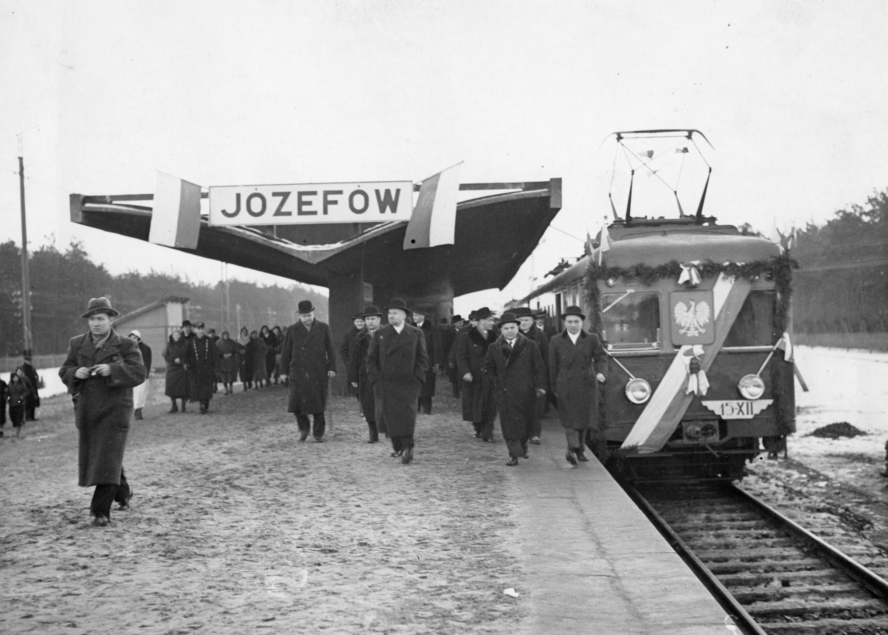
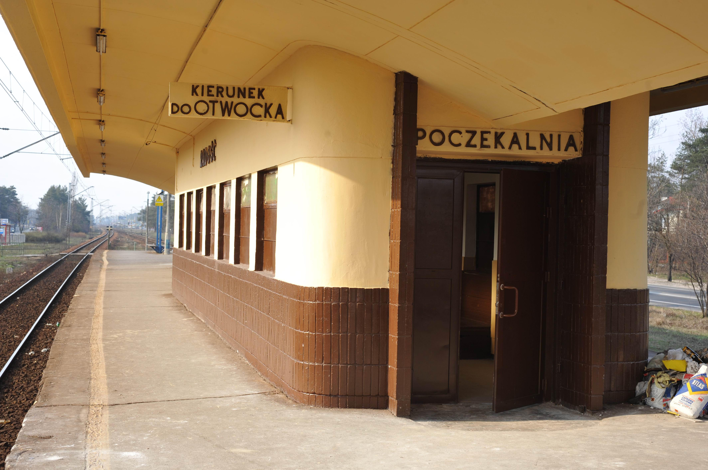
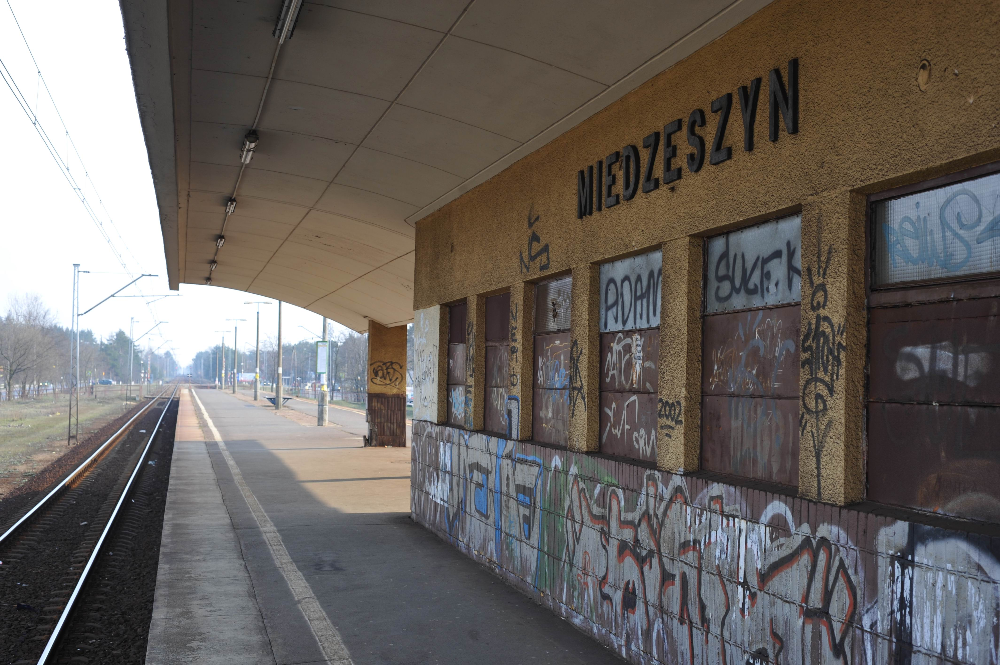

### Linią otwocką podróżują codziennie dziesiątki tysięcy pasażerów. Mimo to poczekalnie na jej przystankach od kilku lat stoją zamknięte. Mimo dużej wartości historycznej i użytkowej, lata zaniedbań pozostawiły je w opłakanym stanie, a pasażerowie, czekający w mroźne dni na pociągi, zadają sobie pytanie: czy jeszcze kiedyś posiedzę w cieple?

Otwocka linia kolejowa znana jest przede wszystkim ze swoich przedwojennych, modernistycznych budynków wiat i poczekalni. Codziennie są one mijane przez masy podróżnych, dojeżdżających z Wawra, Otwocka, Józefa i okolic do pracy czy szkoły w centralnych częściach Warszawy. Niestety drzwi poczekalni są dla nich zamknięte już od kilku lat.

W celu lepszego zrozumienia tematu, warto krótko przybliżyć historię otwockiej linii kolejowej. Początki omawianej linii możemy datować na 1877 rok i otwarcie Żelaznej Drogi Nadwiślańskiej, która przebiegała od Mławy, przez Warszawę i Lublin, do Kowla. „Budowa nowego typu przystanków i wiat peronowych związana była z realizacją koncepcji prof. Aleksandra Wasiutyńskiego budowy linii średnicowej oraz elektryfikacją węzła warszawskiego, którego pomysłodawcą i inicjatorem był prof. Roman Podoski. W 1921 r. opracował on projekt elektryfikacji Warszawskiego Węzła Kolejowego, którego głównym założeniem było rozpoczęcie elektryfikacji sieci PKP, a przede wszystkim zapewnienie obsługi żywiołowo rozwijającego się w dwudziestoleciu międzywojennym ruchu podmiejskiego”[^1].

> Każda poczekalnia na linii otwockiej mogła zmieścić w środku około 20 osób na miejscach siedzących oraz około 30 osób stojących. Poza poczekalniami i kasami biletowymi na niektórych stacjach przewidziano inne udogodnienia dla pasażerów, jak sklepik na przystanku Międzylesie czy barek na stacji Miedzeszyn.

Nowe elektryczne zespoły trakcyjne przystosowane były do kursowania na liniach z wysokimi peronami (pozbawione schodków), wymagane więc było zbudowanie nowych stacji. Większość z nich miała formę peronów wyspowych. Wszystko to miało na celu przyspieszyć wymianę potoków pasażerów[^2]. Zaprojektowano również żelbetowe wiaty połączone z budynkami poczekalni i kas bezpośrednio na peronach. Charakterystyczny, dwuskrzydłowy dach wiaty wsparto na rzędzie filarów, który dzielił peron na dwie strefy. Murowane budynki kas i poczekalni, stanowiące całość z wiatami, zbudowane w stylu streamline, przywodzą swoim wyglądem na myśl nadwozia ówczesnych wagonów osobowych[^3]. Każda poczekalnia mogła zmieścić około 20 osób na miejscach siedzących oraz około 30 osób stojących. Poza poczekalniami i kasami biletowymi na niektórych stacjach przewidziano inne udogodnienia dla pasażerów, jak sklepik na przystanku Międzylesie czy barek na stacji Miedzeszyn[^4].

II wojna światowa nie pozwoliła jednak dokończyć budowy wszystkich przystanków (na przystanku Warszawa Anin nigdy nie powstała planowana wiata i poczekalnia) oraz przyniosła wielkie zniszczenia, gdy „na linii  Warszawa Wschodnia – Otwock w lipcu 1944 r. wojska niemieckie niszczyły tory kolejowe, urządzenia oraz budynki. Przy pomocy dwóch pociągów pancernych i Schienenwolfa (specjalnego urządzenia do niszczenia toru kolejowego) ciągniętego przez lokomotywę przecinano podkłady w środku toru, szyny niszczono natomiast przy użyciu ładunków trotylu”[^5]. Powojenna odbudowa nastąpiła bardzo szybko i już w 1946 roku uruchomiono trakcję elektryczną. Kilka lat później również wszystkie wiaty i poczekalnie na linii otwockiej zostały odbudowane, a na stacji Warszawa Olszynka Grochowska wybudowano nową wiatę z poczekalnią według projektu Kazimierza Brandta[^6].

Przez długie lata, zgodnie z przedwojennymi założeniami projektowymi, pasażerowie mogli korzystać z udogodnień na stacjach linii otwockiej, jednak lata eksploatacji, bez odpowiedniego dbania o stan wiat i poczekalni, zaowocowały ich powolnym niszczeniem. Choć ciężko jest znaleźć dokładne informacje o tym, co z poczekalniami działo się w latach 90., to można założyć, że zmiana ustrojowa na pewno w niczym nie pomogła i losy stacji linii otwockiej były podobne do innych polskich stacji kolejowych w tamtym czasie – zapomniane i niszczejące. W 2010 roku „w związku z planami PKP PLK związanymi z modernizacją linii Warszawa Wschodnia – Lublin i dostosowaniem jej do prędkości 160 km/h władze kolejowe planowały likwidację peronów wyspowych, wiat oraz poczekalni na linii Warszawa Wschodnia – Otwock”[^7]. Dzięki protestom społeczności lokalnej oraz wielu organizacji zajmujących się historią i architekturą sprawa zyskała rozgłos medialny, a stacje otwockiej linii kolejowej udało się wpisać do rejestru zabytków. W następnych latach niektóre budynki wiat i poczekalni zostały odnowione; niestety nie wszystkie. 

> W zamówieniu publicznym dla PKP PLK z 2025 roku, poczekalnie na linii otwockiej opisano jako nieużytkowane pustostany o średnim stanie technicznym, bez ogrzewania, z nieszczelną stolarką okienną i drzwiową, złą izolacją przeciwwilgociową i kilkoma innymi mankamentami.

Poczekalnia na stacji Warszawa Radość zamknięta jest od 2008 rok, o czym świadczą internetowe bazy kolejowe i zdjęcia tam dostępne[^8]. W tym samym roku zamknięto najprawdopodobniej również poczekalnię na PKP Warszawa Miedzeszyn[^9]. Na stacji Otwock Świder remont przeprowadzono wcześniej w 2004 roku, gdyż poczekalnia była w dużo gorszym stanie od reszty na trasie. Po 2010 roku więc nie przeprowadzono tam żadnego remontu, a tamtejsza poczekalnia jest nieczynna od co najmniej 2012 roku, co potwierdzają relacje pasażerów oraz nie bezpośrednio dokumentacja fotograficzna zawarta w zamówieniu publicznym z 2025 roku dla PKP PLK[^10] (stan wnętrza poczekalni wskazuje na dłuższy okres nieużytkowania w porównaniu z resztą poczekalni uwzględnionych w dokumentacji). Na pozostałych stacjach (Warszawa Międzylesie, Michalin, Józefów) poczekalnie prawdopodobnie pozostawały w użytku aż do pandemii COVID-19, gdy ze względu na małą powierzchnię poczekalni najpierw wprowadzono limity ilości osób mogących przebywać wewnątrz, a później kompletnie zamknięto poczekalnie. Pandemia prawdopodobnie spowodowała też zakończenia działalności kawiarni i bistro działających wcześniej w poczekalniach na stacjach Józefów i Warszawa Międzylesie. Gdy pandemia zaczęła wygasać, okresowo otwierano i zamykano poczekalnie na tych stacjach otwockiej linii, mimo to od 2022/2023 roku wszystkie poczekalnie stoją zamknięte, z oknami zasłoniętymi blachami, deskami i kartonami. Prawdopodobnym powodem ich zamknięcia jest ich zły stan techniczny. W wymienionym wyżej zamówieniu publicznym opisano je jako nieużytkowane pustostany o średnim stanie technicznym, bez ogrzewania, z nieszczelną stolarką okienną i drzwiową, złą izolacją przeciwwilgociową i kilkoma innymi mankamentami[^11]. 

Przykładem tego co ma stać się z poczekalniami na linii otwockiej jest poczekalnia na stacji Warszawa Olszynka Grochowska, która po remoncie została oddana do użytku w grudniu 2025 roku. Remont reszty poczekalni ma rozpocząć się w marcu 2026 roku a zakończyć w roku 2028. Plany zakładają, poza oczywistymi pracami konserwatorskimi i konstrukcyjno-budowlanymi, m. in. montaż instalacji grzewczej, instalację wentylacji mechanicznej, instalację zabezpieczeń przeciwpożarowych, montaż monitoringu i stworzenie systemu informacji pasażerskiej[^12]. W projekcie przewidziano również podłączenie budynków do sieci wodociągowej i kanalizacyjnej, więc i stworzenie w środku toalet z oddzielnym wejściem od zewnątrz (prawdopodobnie będą one zlokalizowane w przestrzeni dawnych kas biletowych). Niestety przewidziano również montaż systemu płatnego wejścia (automatu do pobierania opłat) do owych toalet[^13]. Całość wyremontowanych poczekalni ma być dostosowana do potrzeb pasażerów o alternatywnej motoryce, a toalety dostosowane również do potrzeb opiekunów z dziećmi.

> Jeśli optymistycznie przyjmiemy zapowiadane przez PKP PLK terminy remontów stacji, na upragnione poczekalnie na linii otwockiej wystarczy poczekać tylko następne kilka lat.

Poczekalnie na linii otwockiej mają wartość nie tylko historyczną, ale i czysto użytkową, jako podstawowe udogodnienie dla podróżnych oczekujących na pociąg. Ostatnie kilka lat podróżni na trasie Otwock – Warszawa Wschodnia muszą obchodzić się bez takich wygód, co szczególnie odczuwalne jest przy niesprzyjającej pogodzie. Jeśli jednak optymistycznie przyjmiemy zapowiadane terminy remontów, na upragnione poczekalnie wystarczy poczekać następne kilka lat.

[^1]:  A. Skalimowski i Z. Tucholski, *Modernistyczne wiaty i przystanki kolejowe Warszawskiego Węzła Kolejowego. O konieczności ochrony konserwatorskiej*, „Ochrona Zabytków” 2010, nr 1–4, s. 73–84.
[^2]: Ibidem.
[^3]: Ibidem.
[^4]: Ibidem.
[^5]: Ibidem.
[^6]: Ibidem.
[^7]: Ibidem.
[^8]: [Warszawa Radość w bazakolejowa.pl [dostęp 24.01.2026r.]](https://www.bazakolejowa.pl/index.php?dzial=stacje&id=4869&okno=start)
[^9]: [Warszawa Miedzeszyn w fotopolska.eu [dostęp 24.01.2026r.]](https://fotopolska.eu/Warszawa/b142980,Przystanek_kolejowy_Warszawa_Miedzeszyn.html)
[^10]: PFU dla zadania Zaprojektowanie i wykonanie robót pomieszczeń poczekalni na przystankach kolejowych w ramach projektu pn.: „Prace na linii kolejowej nr 7 Warszawa Wschodnia Osobowa - Dorohusk na odcinku Warszawa – Otwock – Dębin – Lublin, etap IIb” (Warszawa Wawer-Otwock), załącznik nr 8 – dokumentacja fotograficzna, s. 44–48.
[^11]: PFU dla zadania Zaprojektowanie i wykonanie robót pomieszczeń poczekalni na przystankach kolejowych w ramach projektu pn.: „Prace na linii kolejowej nr 7 Warszawa Wschodnia Osobowa - Dorohusk na odcinku Warszawa – Otwock – Dębin – Lublin, etap IIb” (Warszawa Wawer-Otwock), 2.2 Aktualne uwarunkowania wykonania przedmiotu zamówienia, 2.2.2.1 Pomieszczenia poczekalni, s. 11–14.
[^12]: PFU dla zadania Zaprojektowanie i wykonanie robót pomieszczeń poczekalni na przystankach kolejowych w ramach projektu pn.: „Prace na linii kolejowej nr 7 Warszawa Wschodnia Osobowa - Dorohusk na odcinku Warszawa – Otwock – Dębin – Lublin, etap IIb” (Warszawa Wawer-Otwock), 3. Zakres robót, s. 14–20.
[^13]: Ibidem.