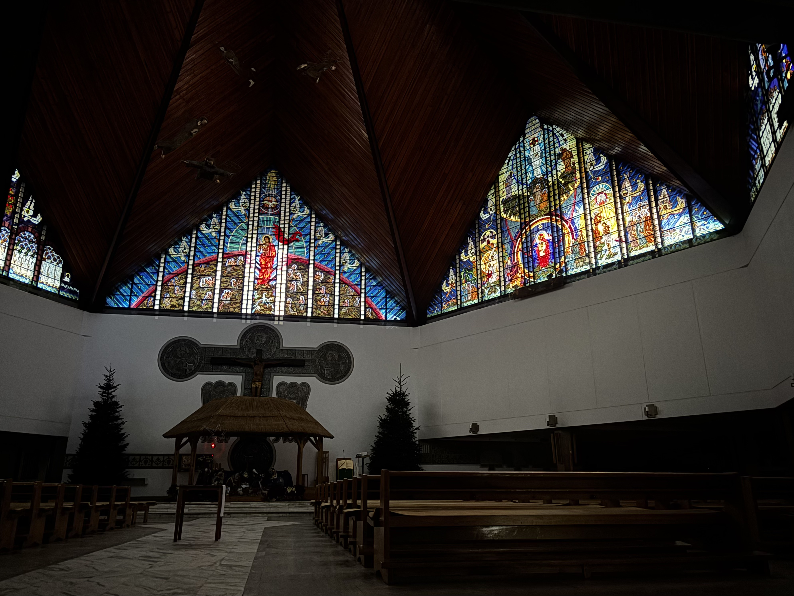
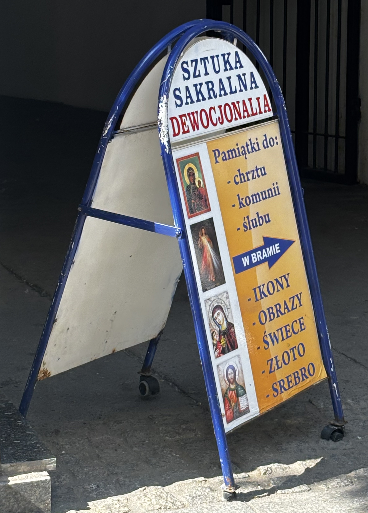

### Kościół może być przestrzenią ulgi także wtedy, gdy nie jest przestrzenią wiary. Cisza, rytuał, architektura i obecność innych zebranych tworzą środowisko, w którym ciało zwalnia, a napięcie traci intensywność. To doświadczenie postsekularne ukazuje kościół jako miejsce afektu, wspólnoty i chwilowego wytchnienia, dostępne zarówno dla wierzących, jak i niewierzących.

Nie wierzę w Boga. A jednak regularnie chodzę do kościoła. Nawiedzam różne przybytki wiary z potrzeby zaznania spokoju. Kościół jest dla mnie miejscem, w którym ciało przestaje być w stanie wzmożonej czujności – ramiona powoli opadają, jakby ktoś zdjął z nich niewidzialny ciężar, a oddech odnajduje swój delikatny, spokojny rytm. Tutaj cisza, nawet ta przerywana kaszlem, szelestem kurtek i skrzypieniem ławek, ma inną gęstość; jest cięższa, a dzięki temu robi się obezwładniająca.

W święto Świętej Rodziny trafiłam do Parafii Trójcy Przenajświętszej w Starych Juchach na Mazurach. Zostały trzy dni do końca 2025 roku, w myślach zabrałam się za robienie bilansu ostatnich dwunastu miesięcy: spraw niedomkniętych, odkładanych, zawieszonych; zadań, które miały zostać zrealizowane, a nie znalazłam na nie ani czasu, ani odwagi. Ten wewnętrzny ciężkawy audyt został przerwany przez scenę, która wydarzyła się na marginesie liturgicznego scenariusza, a jednak – dla mnie – przejęła nad nim kontrolę. 

Msza toczyła się swoim rytmem aż do momentu rozpoczęcia się obrzędowego odnowienia przysięgi małżeńskiej. Małżonkowie zaczęli wychodzić z ławek na środek świątyni, aby ,,w obecności Boga i wspólnoty Kościoła” powtarzać za księdzem słowa ponownej deklaracji miłości, wierności i uczciwości. Przyglądałam się temu uroczystemu wydarzeniu  jakbym była w transie, zaskoczyła mnie liczba par, które zdecydowały się podejść do odnowienia przysięgi. Na swoich miejscach pozostały wyłącznie dzieci i młodzież; tylko nieliczni dorośli nie wstali, choć i na ich dłoniach połyskiwały małżeńskie obrączki. Z zahipnotyzowania wyrwał mnie widok starszego pana, który poruszał się przy pomocy kuli, podniósł się z trudem ze swojej ławki i zaczął przemierzać kościół w poszukiwaniu swojej żony.

Ona – drobna i nieruchoma – pozostała na swoim miejscu, wpatrzona z łagodnym uśmiechem w rozgrywającą się ceremonię odnowienia przysięgi; nie łudziła się, że przy ich ograniczeniach w poruszaniu się zdołają dołączyć do par stojących przed ołtarzem. Kiedy mąż zrównał się z ławką, w której siedziała, podał jej rękę. Najpierw na twarzy seniorki pojawiło się zaskoczenie, które niemal natychmiast ustąpiło miejsca szerokiemu uśmiechowi. Wstawali powoli, z wysiłkiem, wspólnymi siłami udało im się doczłapać na środek kościoła. Po wypowiedzeniu słów przysięgi mężczyzna złożył kobiecie pocałunek na policzku – był to gest prosty, pozbawiony patosu, a jednak wyjątkowo mnie poruszył. 

Patrzyłam na nich z daleka. Poczułam, jak łza spływa mi po policzku, a wraz z nią odpływa napięcie podsycane wcześniejszym niepokojem o marne rezultaty moich całorocznych poczynań. Przestałam myśleć o rzeczach, które powinnam była zrobić, o tym, co mi nie wyszło. Pojawiła się ulga – moje codzienne problemy nie wyparowały, ale na moment przestały wydawać się takie przygniatające. Wiedziałam, że w kościele znajdę wytchnienie, ale dopiero gdy rzeczywiście się w nim znalazłam, uświadomiłam sobie, jak ogromny spokój przynosi mi przebywanie w przestrzeniach sakralnych. Bliskość między ludźmi, wspólne kolędowanie, jednostajny i monotonny głos księdza, łagodne światło, starannie udekorowane wnętrze oraz czysty dźwięk organów stworzyły chwilę  prawdziwego ukojenia – taką, której szukałam i którą w końcu udało mi się odnaleźć.

Nie zgadzam się z kazaniami. Ich przekaz pozostaje dla mnie obcy, często wręcz drażniący. A jednak sama struktura mowy – monotonna i rytmiczna – ma działanie uspokajające. Głos księdza, pozornie centralny, rozprasza się w przestrzeni, traci ostrość, staje się dźwiękowym tłem. Jest jak metronom regulujący tempo mojej obecności. Dla mnie kazanie nie jest komunikatem, jest elementem pejzażu akustycznego.

To doświadczenie – bycia w przestrzeni kościoła bez wiary, które mimo wszystko zachowuje silny wymiar emocjonalny – sytuuję w polu postsekularyzmu, rozumianego w sposób zaproponowany przez Jürgena Habermasa jako uznanie trwałej obecności religii w warunkach nowoczesności oraz niemożności całkowitego wyparcia jej wymiaru symbolicznego i afektywnego przez świecką racjonalność [^1]. Postsekularyzm nie oznacza powrotu do religii ani jej rehabilitacji, jawi się raczej jako uznanie faktu, że nowoczesność nie zniosła transcendencji, a świeckość nie zdołała wyeliminować potrzeb rytuału, przynależności do wspólnoty i symbolicznego porządku. W perspektywie postsekularnej religia przestaje być wyłącznie systemem wierzeń, a zaczyna funkcjonować jako przestrzeń doświadczenia – cielesnego, afektywnego, relacyjnego. Kościół staje się wtedy nie tyle miejscem wiary, ile obszarem afektu: sceną, na której rozgrywają się gesty troski, trwania i bycia razem, dostępne także dla tych, którym nie są bliskie teologiczne założenia tego tworu.

> W perspektywie postsekularnej religia przestaje być wyłącznie systemem wierzeń, a zaczyna funkcjonować jako przestrzeń doświadczenia – cielesnego, afektywnego, relacyjnego.

Ulga, której tam doświadczam, nie ma charakteru metafizycznego. Ma wymiar somatyczny i chwilowy. Religia produkuje doświadczenia autentyczne, skuteczne i trudne do zastąpienia innymi formami organizacji sensu i odczuwania. Kościół można czytać jako infrastrukturę afektu: przestrzeń zaprojektowaną do regulowania stanów cielesnych i emocjonalnych. Dźwięk organów, zapach kadzidła, chłód murów – wszystko to tworzy środowisko sensoryczne, które nie wymaga interpretacji, a jedynie obecności. Afekt krąży w kościelnej przestrzeni nie jako indywidualne przeżycie, ale jako współdzielone doznanie. Architektura kościoła, jego rytmiczna organizacja i materialny charakter wpływają na użytkowników niezależnie od ich relacji z doktryną katolicką. Pozostaje on jedną z nielicznych przestrzeni, w których ulga nie jest efektem pracy ani rezultatem konsumpcji.

> Religia produkuje doświadczenia autentyczne, skuteczne i trudne do zastąpienia innymi formami organizacji sensu i odczuwania.

Kościół – rozumiany nie tylko jako instytucja, ale jako konkretna przestrzeń architektoniczna – jest miejscem, które daje symboliczne zakorzenienie. Współczesna architektura sakralna, jak zauważa Jan Rabiej, funkcjonuje dziś w napięciu pomiędzy tradycją liturgiczną a zmieniającym się środowiskiem kulturowym [^2]. Nawet jeśli nie wierzymy, nasze ciało wie, jak się zachować: gdzie usiąść, kiedy wstać, zaczynamy ciszej mówić. Ta wyuczona, niemal automatyczna relacja z przestrzenią przynosi ukojenie. Kościół oferuje tymczasowe obniżenie intensywności przeżywania trudów codzienności. Jest to szczególnie istotne w kontekście dostępnych dzisiaj form regulacji napięcia, które w większości zostały sprywatyzowane lub skomercjalizowane.

> Kościół oferuje tymczasowe obniżenie intensywności przeżywania trudów codzienności.

Ulga, której doświadczam w kościele, ma charakter wielopoziomowy. Jest to ulga sensoryczna – wynikająca z odcięcia od bodźców, spowolnienia ruchu, ograniczenia dźwięków. Rozumiem to jako przedrefleksyjną warstwę kontaktu z przestrzenią i to właśnie ona jest istotna dla doznania postsekularnej ulgi. Jest to także ulga estetyczna: obcowanie z uporządkowaną przestrzenią, z materiałami o ciężarze symbolicznym. Beton, kamień, drewno – jak zauważa Aleksandra Tejszerska, w architekturze sakralnej często są przeciwstawiane efemeryczności współczesnego świata [^3]. Stabilność jest wyrażana poprzez trwałość i masywność, nawet gdy brak im odniesień duchowych. 

Szczególnym fenomenem jest dla mnie przekazywanie sobie znaku pokoju. Ten krótki, niemal mechaniczny gest – uścisk dłoni, skinienie głowy, wymiana krótkich spojrzeń – uruchamia wyjątkowy rodzaj wspólnotowości, który wykracza poza deklaracje wiary i osobiste przekonania. W trakcie przekazywania sobie znaku pokoju zanikają społeczne dystanse: nie ma znaczenia, czy ludzie znają się od lat, czy widzą się tylko w przestrzeni kościoła, ani jaki jest ich stosunek do religii. Ten element mszy buduje atmosferę ciepła, życzliwości i wzajemnego uznania, opartą na ludzkiej otwartości wobec bliźniego.

Dla osób niewierzących uczestnictwo w tym momencie nabożeństwa nie musi oznaczać identyfikacji z wymiarem religijnym liturgii, może być doświadczeniem czysto społecznym i emocjonalnym. To chwila, w której wspólnota umacnia się nie poprzez pokrewne przekonania, ale poprzez gotowość do bycia razem, do okazania sobie serdeczności i szacunku. Znak pokoju działa więc jak neutralny kod komunikacji międzyludzkiej: pozwala na chwilowe zawieszenie różnic światopoglądowych i buduje przestrzeń, w której ludzie nie są poróżnieni, ale symbolicznie ze sobą zrównani.

> Znak pokoju działa więc jak neutralny kod komunikacji międzyludzkiej: pozwala na chwilowe zawieszenie różnic światopoglądowych i buduje przestrzeń, w której ludzie nie są wobec siebie poróżnieni, ale symbolicznie zrównani.

W tym ujęciu gest ten ujawnia uniwersalny potencjał rytuału – nawet jeśli jego źródło jest religijne, to jego oddziaływanie ma charakter społeczny. Tworzy krótkotrwałe, ale silne poczucie wspólnotowości oparte na wzajemnej życzliwości, która obejmuje zarówno osoby głęboko wierzące, jak i te, które traktują ten moment jako formę uczestnictwa w zbiorowym doświadczeniu bliskości i akceptacji. 

Podobny mechanizm działa w samej strukturze mszy i obrzędów religijnych. Ich przewidywalność, powtarzalność i jasno określony porządek przynoszą poczucie spokoju i bezpieczeństwa. W świecie zdominowanym przez niepewność, nadmiar bodźców i zmienność, rytuał staje się przestrzenią stabilności. Wiadomo, co nastąpi po czym, jakie gesty zostaną wykonane, jakie słowa padną. Ta regularność porządkuje doświadczenie i pozwala na odłączenie się od codziennego chaosu. Przewidywalność rytuału działa więc jak forma psychicznego zakotwiczenia, dając wrażenie kontroli i ciągłości w rzeczywistości, która na co dzień bywa nieprzewidywalna i rozproszona.

Dla osób wierzących ulga, o której piszę ma znacznie głębszy wymiar. Wizyta w kościele nie jest jedynie doświadczeniem estetycznym czy społecznym, lecz aktem powrotu do duchowego porządku. Kościół staje się miejscem, w którym można złożyć swoje niepokoje, lęki i wątpliwości, powierzyć je bezpośrednio Bogu lub kapłanowi - jego pośrednikowi. Udanie się do kościoła dla wierzących jest czasem, w którym codzienne napięcia zostają wpisane w szerszą perspektywę, a indywidualne doświadczenie zyskuje sens w ramach wspólnoty i wiary. Ulga nie wynika więc jedynie z samej struktury rytuału, lecz z przekonania, że istnieje stały punkt odniesienia, który daje oparcie, nadzieję i poczucie trwałości.

Ulga, której doświadczam w przestrzeni kościoła jako osoba niewierząca, nie jest więc paradoksem ani niekonsekwencją. Jest efektem spotkania ciała z przestrzenią, która została zaprojektowana do wyhamowywania, porządkowania i wyciszania. Nie potrzebuję wiary, by to na mnie działało. Kościół jest dla mnie miejscem, w którym świat na chwilę zwalnia, a ja mogę wyjść z trybu ciągłej gotowości. Przestrzenią, gdzie nie muszę niczego osiągać ani uzasadniać swojej obecności. Przechwytuję jej afektywny potencjał: zdolność do regulowania napięcia, do budowania wspólnotowego spokoju, do oferowania ulgi. 

Moja ulga jest świecka w swoim źródle, ale nie da się jej całkowicie oddzielić od religijnego kontekstu, który ją umożliwia. To właśnie ta niejednoznaczność czyni ją postsekularną. Nie chodzi o pojednanie z instytucją ani o powrót do wiary, ale o dostrzeżenie, że religia nadal porządkuje sposoby przeżywania rzeczywistości, z których korzystają również osoby niezgadzające się z jej przekazem.

W kościele nie szukam sensu, odpowiedzi ani pocieszenia w znaczeniu metafizycznym. Ulga, której doświadczam kształtuje się pod wpływem wielu czynników. Jest złożona, warstwowa, rozciągnięta pomiędzy ciałem, przestrzenią, poczuciem bycia częścią wspólnoty oraz między pamięcią kulturową. Szukam obniżenia napięcia, spowolnienia, krótkiej przerwy od siebie samej. Dla mnie kościół nie jest jedynie oczywistym centrum życia wspólnotowego, jest przestrzenią ciszy, kontemplacji i estetycznego doświadczenia, a ulga, której w nim zaznaję nie rozwiązuje moich problemów, ale zmienia ich skalę. I to wystarcza.

[^1]: J. Habermas, *Wierzyć i wiedzieć* , tłum. Małgorzata Łukasiewicz, w: „Znak” 2002, nr 568, s. 8–21.
(oryg.: *Glauben und Wissen*, wykład wygłoszony 14 października 2001 r. w kościele św. Pawła we Frankfurcie z okazji przyznania Pokojowej Nagrody Niemieckich Księgarzy).

[^2]:  J. Rabiej, *Współczesna architektura sakralna Kościoła katolickiego – przestrzeń Eucharystii w środowisku kulturowym*, „Ruch Biblijny i Liturgiczny” 2018, t. 71, nr 3, s. 221–236.

[^3]: A. Tejszerska, *Współczesna architektura sakralna na tle ponowoczesnych tendencji kulturowych*, „Architectus” 2015, nr 1(41), s. 55–68.

