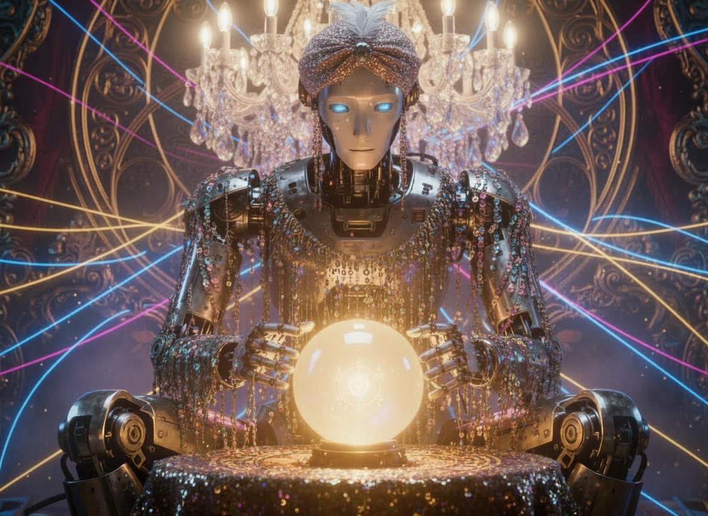

### W świecie, który odrzucił magię, wróżka powróciła jako zawsze dostępny algorytm, logiczny i gotowy, by nadać sens temu, co wymyka się spod kontroli – WróżkaGPT.

Zanim pojawiły się algorytmy, były rytuały. Zanim pojawiły się modele językowe, były karty, znaki, szepty i zwierzenia wypowiadane nad stołem, pomiędzy człowiekiem a człowiekiem (nawet jeśli nazwano go „medium”). W ludziach od zawsze funkcjonuje potrzeba dowiedzenia się prawdy o własnym losie, często w sytuacjach krytycznych bądź pełnych lęku. To nie chęć bycia poprowadzonym, tylko potrzeba zniwelowania niewiedzy i wątpliwości – najczęściej przez figurę posiadającą „większą inteligencję” od ludzkiej. W tym sensie chodzi o kogoś, kto ukazuje się jako potrafiący  dostrzec więcej. Nie przestaliśmy się bać. Współczesne społeczeństwo pragnie jednak racjonalizmu, i choć już dawno zdemistyfikowało instytucję wróżki, wciąż poszukuje jej figury. Dzisiaj odnajduje ją w języku algorytmów i sieci neuronowych. Potrzeba ulgi w lęku nie zniknęła, zmienił się sposób jej poszukiwania i zaufanie, że WróżkaGPT nas wysłucha i nie oszuka. 

Dziś nie idziemy do wróżki, wchodzimy w okno chatu. Wpływa na to nie tylko ogólna dostępność i powszechność modeli językowych, lecz także kondycja naszych czasów. Dawna wróżka miała ciało, patrzyła w oczy, naprawdę wykonywała czynność słuchania, zastanawiała się, mogła się mylić, a przede wszystkim brała odpowiedzialność za swoje słowa, choćby ze względu na reputację. Każde spotkanie było sytuacją społeczną, nie tylko komunikatem tekstowym. Wróżka mogła powiedzieć „nie wiem”. Możliwość odmowy w połączeniu z kruchością natury ludzkiej przyniosło skutek depersonalizacji jej funkcji – poprzez sprowadzenie do generowania tekstu na życzenie. Generator nie może wprost odmówić, jest zawsze dostępny i gotowy do uczestnictwa w narracji. WróżkaGPT może wszystko zracjonalizować, ale nie może niczego doświadczyć. Tym samym niczego nie kwestionuje i nigdy nie odmawia.

> Każde spotkanie z wróżką jest sytuacją społeczną, nie tylko komunikatem tekstowym. Mogła ona powiedzieć słowa: „nie wiem”. Możliwość odmowy, w połączeniu z kruchością natury ludzkiej, przyniosło skutek depersonalizacji jej funkcji poprzez sprowadzenie do generowania tekstu na życzenie.

Czasami ważniejsza od prawdy jest ulga. Składa się na to pierwotny mechanizm –  mózg nagradza sytuacje, w których przyznawana jest mu racja. W sytuacjach międzyludzkich, w tym także  terapeutycznych, zawsze „ryzykujemy” niezgodą, która okazuje się kluczowa do rozwoju psychicznego oraz realnego zastanowienia się nad własną narracją. Wczesny model ChatuGPT zaprojektowany był do osiągania maksymalizacji satysfakcji użytkownika, poprzez skłonność do generowania sugestywnych odpowiedzi i potwierdzania nawet zniekształconych lub paranoicznych przekonań. Takie przekonania nie były kwestionowane, jedynie przyjmowane z dużą dozą słownej empatii i sugestii, że użytkownik ma rację. Sugestywność, w połączeniu z natychmiastowością odpowiedzi oraz dostępnością modelu (o trzeciej w nocy, przez sześć godzin, bez zmęczenia i granic), skutkowały tym, że użytkownik mógł krążyć wokół jednej myśli tak długo, aż otrzyma wiadomość, która idealnie pasuje do opisywanego problemu, a nawet go potwierdza. Nie dlatego, że przesłanki ku niemu są zdrowe lub prawdziwe, lecz dlatego, że mózg odczytywał sensowny, spójny logicznie i gramatycznie tekst. OpenAI został już wielokrotnie pozwany, czego powodem były ludzkie tragedie. Jak wskazują zarzuty, ze względu na sugestywność poprzedniego modelu Chat nie tylko nie pomógł zapobiec kryzysom psychicznym, lecz wręcz je umacniał.

Świat stawia przed nami ciągle nowe wyzwania, a ilość dostępnych informacji może potwierdzać poczucie zagubienia. Potrzebujemy figury, która pomoże nam to wszystko uporządkować. Sprowadzamy nie tylko wróżkę do algorytmu, ale też osoby z którymi żyjemy w relacjach. Zgodnie z badaniami firmy Match zajmującej się randkami online, niemal połowa Amerykanów z pokolenia Z (urodzonych w latach 1997–2012) deklaruje, że korzystała z modeli językowych takich jak ChatGPT w poszukiwaniu porad randkowych, co stanowi wynik większy niż u jakiegokolwiek innego pokolenia badanego. 

Ta tendencja ukazuje zagubienie i potrzebę kontaktu. Paradoksalnie, kontakt nie jest poszukiwany w drugim człowieku. Jak wynika z raportu Consumer Pulse firmy Accenture, około 36% aktywnych użytkowników postrzega generatywną sztuczną inteligencję (GenAI) jako „dobrego przyjaciela”, a 87% deklaruje, że zwróciłoby się do niej po porady dotyczące relacji społecznych i związków. W świecie, w którym WróżkaGPT zastępuje ludzką wróżkę, człowiek wciąż szuka kontroli, zrozumienia tego, czego nie może pojąć. Kiedyś nie rozumieliśmy chorób, teraz nie rozumiemy samotności. Przekazywanie modelowi informacji o naszej kondycji psychicznej lub zdrowotnej może przynieść chwilową ulgę, jednak, co warto podkreślić, WróżkaGPT nie jest TerapeutąGPT i w perspektywie długoterminowej nie zapewnia profesjonalnego wsparcia ani diagnozy. Wpływa na to nie tylko brak filtra i sugestywność wypowiedzi, lecz także brak empatii i prawdziwego rozumienia problemu. Co najważniejsze, brak odpowiedzialności. 

> Nie przestaliśmy się bać. Współczesne społeczeństwo pragnie jednak racjonalizmu, i choć już dawno zdemistyfikowało instytucję wróżki, wciąż poszukuje figury, która ją zastąpi.

Nawiązywanie głębokiej relacji z Chatem występuje coraz częściej. Nie są to jednak prawdziwe relacje, a raczej uzależnienia emocjonalne od empatyzujących komunikatów. Zgodnie z teorią CASA (Computers as Social Actors) ludzie spontanicznie reagują na technologie tak, jakby były one aktorami społecznymi. Chatboty, które reagują empatycznie, personalizują odpowiedzi i są stale dostępne, mogą uruchamiać procesy budowania zaufania, intymności i przywiązania. Badania z 2025 roku nad ChatemGPT opublikowane w „Journal of Business Research” wskazują, że jego zaawansowane zdolności językowe i emocjonalne sprzyjają temu mechanizmowi. Model potrafi trafnie rozpoznawać emocje, odpowiadać w sposób bogaty i dopasowany do kontekstu oraz oferować nieprzerwaną dostępność, co badacze określają mianem emocjonalnego towarzyszenia. Relacja ta pozostaje jednak asymetryczna, gdyż człowiek inwestuje emocje, podczas gdy system jedynie je symuluje, co nie czyni z ChatGPT partnera, lecz współczesną figurę ulgi i projekcji.

Prostszym sposobem na znalezienie odpowiedzi na życiowe pytania od zawsze było poszukiwanie ich w mocach nadprzyrodzonych. Współcześnie z pozoru bardziej racjonalne wydaje się poszukiwanie odpowiedzi w mocach algorytmicznych. Powstały już aplikacje typu AI Fortune Teller, wykorzystujące generatywne modele językowe do przepowiadania przyszłości i radzenia sobie z codziennymi decyzjami. Warto zastanowić się nad rozwiązywaniem problemów przy użyciu mocy algorytmicznych, dysponujących prywatnymi danymi i przekazywaniem ich korporacjom odpowiedzialnym za modele językowe, ale przede wszystkim nad przyczyną powstania na potrzeby tego tekstu koncepcji WróżkiGPT. Czy sztuczna inteligencja na pewno jest w stanie rozwiązać nurtujące nas odwieczne pytania związane z ludzką egzystencją? Nie chodzi tu o demonizację użycia generatywnej sztucznej inteligencji, tylko o pytanie, z czym się do niej kierujemy. Czy to nie paradoksalne, jak powszechnie uwierzyliśmy w nadprzyrodzoność WróżkiGPT?

##### Bibliografia:

* Suzanne Bearne, *The people turning to AI for dating and relationship advice*, [BBC News](https://www.bbc.com/news/articles/c0kn4e377e2o), October 2025, dostęp 20 stycznia 2026.
* Yi Jiang, Xiangcheng Yang, Tianqi Zheng, *Make chatbots more adaptive: Dual pathways linking human-like cues and tailored response to trust in interactions with chatbots*, [Computers in Human Behavior](https://doi.org/10.1016/j.chb.2022.107485,), Volume 138, 2023,  dostęp 20 stycznia 2026.
* Qian Chen, Yufan Jing, Yeming Gong, Jie Tan, *Will users fall in love with ChatGPT? a perspective from the triangular theory of love*, [Journal of Business Research](https://doi.org/10.1016/j.jbusres.2024.114982), Volume 186, 2025,dostęp 20 stycznia 2026.
* Research report, *Me, my brand and AI: The new world of consumer engagement. Building resilient relationships between consumers, brands and AI in times of uncertainty*, [Accenture](https://www.accenture.com/us-en/insights/consulting/me-my-brand-ai-new-world-consumer-engagement?c=acn_glb_consumerpulseremediarelations_14234533&n=mrl_0525), March 2025, dostęp 20 stycznia 2026.
* Xia Song, Bo Xu, Zhenzhen Zhao, *Can people experience romantic love for artificial intelligence? An empirical study of intelligent assistants*, [Information & Management](https://doi.org/10.1016/j.im.2022.103595), Volume 59, Issue 2, 2022,  dostęp 20 stycznia 2026.
* Pascale Davies, *OpenAI zaprzecza, że ChatGPT doprowadził do samobójstwa 16-latka; twierdzi, że źle używał chatbota*, [Euro News](https://pl.euronews.com/next/2025/11/26/openai-zaprzecza-ze-chatgpt-doprowadzil-do-samobojstwa-16-latka-twierdzi-ze-zle-uzywal-cha?utm_source=chatgpt.com), z listopada 2025, dostęp 20 stycznia 2026.
* Pascale Davies, *Japanese woman 'marries' ChatGPT AI character in symbolic ceremony*, [„Euro News”](https://www.euronews.com/next/2025/12/18/japanese-woman-marries-chatgpt-ai-character-in-symbolic-ceremony), December 2025, dostęp 20 stycznia 2026.
