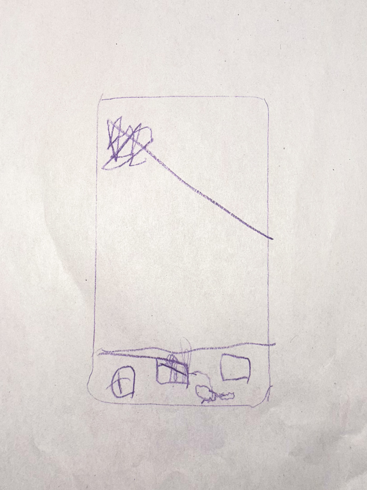

### Telefony tworzą świat w świecie. Przyjmując rolę odrębnej rzeczywistości, pozwalają na regulację pragnień: ucieczki i odpoczynku. Z pozoru ułatwiając nam życie, jednocześnie je obciążają.

Urządzenia mobilne to najbardziej powszechnie obecne przedmioty w naszej współczesnej codzienności. Zdecydowana większość osób, jakie spotykamy, z jakimi połączeni jesteśmy przez grona społeczne, szkołę czy pracę – jest od nich zależna. Towarzyszą ludziom z praktycznie wszystkich pokoleń od rana do wieczora i jako takie stanowią niezwykle ważną część tkanki naszego życia. Ich rola jest znormalizowana, trudno jest bowiem stawiać diagnozy wobec własnej sytuacji jak żaba ze znanej przypowieści – ze środka garnka, w którym woda powoli się gotuje. 
Jednocześnie telefony to temat wielkich dyskusji, szczególnie z perspektywy wpływu ekranów na dzieci. Są one istotami od nas zależnymi, łatwiej jest widzieć je jako ofiary sytuacji, skoro chcemy wyobrazić sobie dla nich w przyszłości dobre życie. Tymczasem obserwujemy jak ciągłe korzystanie z platform mobilnych blokuje ich rozwój; i to mimo tego, że zdajemy sobie sprawę z tej dziwnej relacji zależności od małego, magicznego prostokąta i wpływu jaki na nas wywiera. Przez to jak, wydawałoby się, nieodwołalnie wpleciona jest obecność telefonów w każdą płaszczyznę rzeczywistości, są one niezwykle trudne do rzucenia. Piszę o „telefonie” jako fragmencie naszego codziennego słownika, elemencie naszej najbliższej rzeczywistości, jednak mam również na myśli całość kultury scrollingu i cyberprzestrzeni, czyli pewnego absolutnego przywiązania do sfery online, wychodzącej poza same aplikacje. Sprowadzam to do tego jednego obrazka, telefonu okupującego nasze dłonie i kieszenie, ponieważ jako symbol mieści on w sobie więcej niż jestem w stanie wytłumaczyć.
W logice wykonywania zadań codzienności kapitalistycznego napędu sięgnięcie po telefon jest doświadczeniem równoznacznym odprężeniu. Jest popularną formą spędzania wolnego czasu i dla wielu główną formą odpoczynku podczas długiego dnia. Ciągle przecież momenty, w których przechwytuje nas jego czar, to chwile, nawet niezwykle krótkie, w których spotykamy się z pragnieniem chwilowej ulgi. Służy on przerywaniu strumieni myśli i odcinaniu się od wymagań. W trakcie przejazdu komunikacją miejską, kiedy dopada nas zmora nudy, w trakcie trudu pracy – czy to fizycznej, czy intelektualnej – kiedy pojawia się chwilowa myśl, żeby jednak odpuścić, wieczorem, kiedy chcemy już tylko odpocząć, najłatwiej jest ulżyć sobie tym, co zawsze pod ręką, zawsze dostępne i co bezwiednie wprowadza nas w stan kompletnego wyłączenia. „Kto kiedykolwiek świadomie poświęcał uwagę reklamie na Facebook’u?” – zwraca uwagę brytyjski teoretyk Mark Fisher [^1]. 

> Przy każdym instynktownym zerknięciu w telefon pozwalamy sobie na kolejną, bardziej lub mniej mikro, dawkę de facto wystąpienia z otaczającego nas świata.

Telefon żeruje na naszej podświadomości oraz na świadomej uwadze [^2], przechwytując je, kiedy tylko znajdzie się na to okazja. W tym rozumieniu jest on narzędziem regulacyjnym, jest obecny jako odpowiedź zawsze, gdy pojawia się napięcie i potrzeba szybkiego jego rozładowania. Przy każdym instynktownym zerknięciu w telefon, wtopieniu się w potrzebę nowego powiadomienia czy wstąpieniu w zasysającą czarną dziurę, jaką jest niekończąca się ściana reelsów – ciągle pozwalamy sobie na kolejną, bardziej lub mniej mikro, dawkę de facto wystąpienia z otaczającego nas świata. Ale ulga, jakiej dostarcza kontakt z telefonem, wychodząca z pragnienia odpoczynku w sensie realnego braku produktywności i polegająca na tym wymuszonym wyciszeniu poprzez przebodźcowanie, jest pusta, fałszywa, nie prowadzi do większej regeneracji, nie domyka wewnętrznych procesów, uniemożliwia pełne przepracowanie; jest jak bycie na ciągłym haju lub zabijanie głodu kartonem i watą. Jako uzależnienie spowalnia nas i immobilizuje – także dosłownie, ustawiając nasze ciała w konkretne pozycje i unieruchamiając je, okrajając nasze zmysły z postrzegania świata i koncentrując je w jednym miejscu błyskających świateł, dźwięków i (zbyt) szybko zmieniających się tematów. Można odbierać jego funkcję jako rodzaj narkozy. Dodatkowo ciągła wielowątkowość, odczuwalna zarówno w skakaniu pomiędzy platformami (zautomatyzowanym sprawdzaniu powiadomień na mailu i jednoczesnym przeglądaniu paru portali społecznościowych), jak i ekranami (przykładowa sytuacja sięgania po telefon w trakcie korzystania z komputera), „rodzi stałą uwagę częściową, stan równoczesnego zaabsorbowania i rozproszonego znudzenia, wiecznego odwleczenia i niezdecydowania” [^3]. 

> Odpoczynek od świata realnego odbywa się w telefonie – świecie będącym jego przedłużeniem.

Świat, do którego przenosimy się codziennie za pomocą urządzeń mobilnych, stanowi formę ucieczki, w pewien sposób odpowiedź na niemożliwe warunki życia w kapitalizmie, a jednocześnie, między innymi pełniąc funkcję docelowego narzędzia wypoczynku, ustanowił się jako ogromnie ważna część mechanizmu ich utrzymania. Nie jest odrębny, odpoczynek od świata realnego odbywa się w świecie będącym jego przedłużeniem. Cyberprzestrzeń sama w sobie jest życiem w mikroskali i mimo swojego pierwotnego potencjału wyzwoleńczego, zawiera w sobie pracę, rozrywkę i wszystko pomiędzy i poza nimi, łącznie z całościowym uwikłaniem w kapitalistyczny system. Telefon w doświadczeniu funkcjonuje jako coś „poza” mimo tego, że takim właściwie nie jest. Jest wszechobecny, a symboliczne wypchnięty poza realność. 
Życie realne oraz życie w ekranie są od siebie uzależnione, strukturalnie splecione, nie ma bowiem świata ekranowego bez świata realnego, a świat ekranowy ma zdecydowanie wpływ na świat realny; jednak przeżywane są jako oddzielne. O pewnej niezależności odbioru tych światów świadczy w pewnym stopniu sam fakt, że istnieją w dualizmie, są ustawione wobec siebie w opozycji. Na co dzień mamy do czynienia z oboma fragmentami tej opozycji, przeskakujemy z jednego w drugi i jeden dla drugiego stanowi możliwość odskoczni – tak samo jak od codzienności uciekamy wracając ciągle do telefonu, tak od telefonu staramy się też uciec wracając do rzeczywistości, kiedy męczy zesłana przez niego immobilizacja i pojawia się przed nami pragnienie „dotknięcia trawy”. Zatem przeskakiwanie pomiędzy rzeczywistościami jako mechanizm regulacyjny, w którym telefon staje się progiem, ale pomiędzy pokojami w tym samym domu, jest złudne. Po drugiej stronie ulgi pojawia się to samo i w efekcie odbijamy się jak piłeczka ping pongowa pomiędzy prawdą a prawdą. Albo fałszem i fałszem.

Ostatnio mój podopieczny, przy odbieraniu go z przedszkola, pokazał mi rysunek, który narysował właśnie w świetlicy. Obrazek był wykonany szybko, był zapisem idei w sposób dziecięco zautomatyzowany, porównywalny do schematycznego narysowania domku lub ludzika patyczaka. To pionowy prostokąt, na dole którego około pięć nieregularnych elementów układa się w pasie, a na środku widniał jeden wielki bazgroł. Elementy w pasie to było oczywiście główne menu w telefonie dotykowym, a kłączowaty bazgroł świetnie oddawał niekończącą się i niezrozumiałą zawartość. Rysunek smartphone’a instynktownie wydał mi się absurdalny do wykonania przez dziecko. Nie powinien należeć do jego wyobrażenia najbliższej rzeczywistości, w ten sam sposób co mama, rodzeństwo, kwiatki, postać z książki czy piesek; być częścią świata takiego, jakim chcemy postrzegać go u swoich podstaw. 
Telefon stanowi dziś kluczową już część naszych rzeczywistości, jednocześnie będąc czymś, co w jakimś stopniu od niej odłączamy i nie chcemy widzieć jako tak wpływowe, jak faktycznie jest. Środkowy bazgroł w rysunku pozostaje jednak wierną reprezentacją tego, co wspólne dla świata cyfrowego i tego poza nim, czyli nieskończoności, wielości i niemożności pełnego uporządkowania życia.

[^1]: M. Fisher, Touchscreen Capture, w "Noon 6: An Annual Journal of Visual Culture and Contemporary Art", 2016, s.15.

[^2]: Tamże.

[^3]: A. Karalus, T. Adamczewski, Mark Fisher. Od hauntologii do estetyki zewnętrzności, w: M. Fisher  Dziwaczne i osobliwe, tłum. A. Karalus, T. Adamczewski, słowo/obraz terytoria, Gdańsk 2023, s. 145.

##### Bibliografia
* M. Fisher, Touchscreen Capture, w "Noon 6: An Annual Journal of Visual Culture and Contemporary Art", 2016
* A. Karalus, T. Adamczewski, Mark Fisher. Od hauntologii do estetyki zewnętrzności, w: M. Fisher  Dziwaczne i osobliwe, tłum. A. Karalus, T. Adamczewski, słowo/obraz terytoria, Gdańsk 2023
