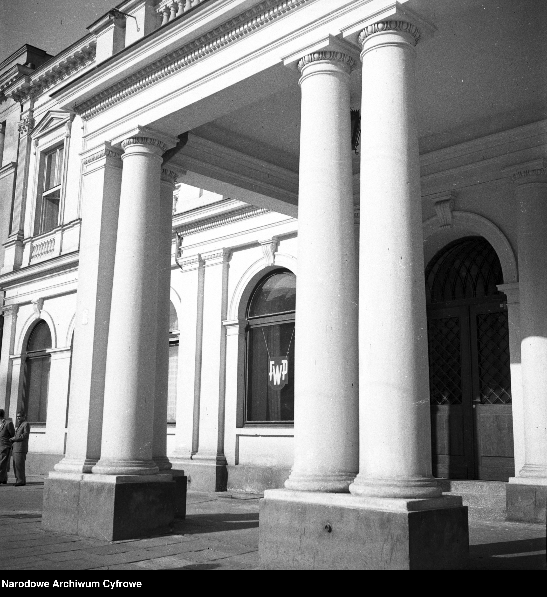
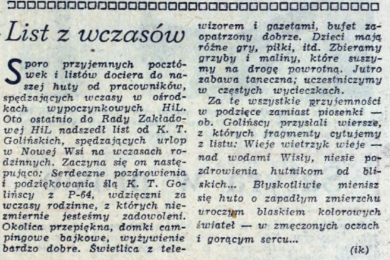
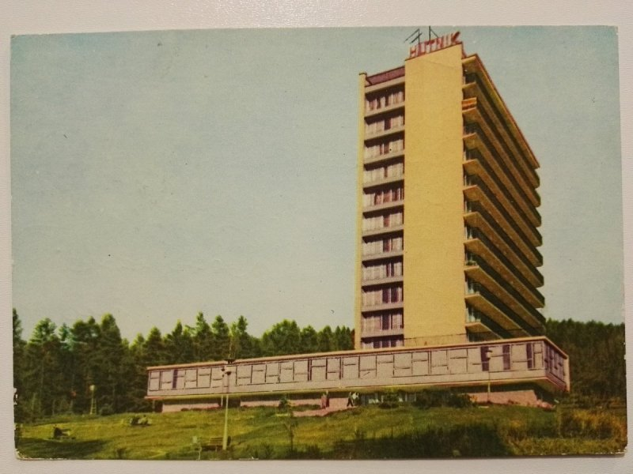

### Dzisiejszy urlop traktujemy jako oczywisty element życia zawodowego,  jednak nie zawsze tak było. Wczasy pracownicze, sanatoria i inne formy wypoczynku stanowiły wyraz ideologii ówczesnej władzy. Działalność Funduszu Wczasów Pracowniczych instytucjonalizowała poczucie ulgi od pracy.  Zarazem stała się przykładem instytucjonalnej organizacji czasu wolnego w socjalistycznej Polsce.

*Obywatele Polskiej Rzeczypospolitej Ludowej mają prawo do wypoczynku* – głosił art. 59 pkt. 1 Konstytucji PRL. W ten sposób już niemal od początku istnienia Polski Ludowej urlop stał częścią życia obywateli. Rodzaje odpoczynku, z jakimi mamy do czynienia w dzisiejszych czasach znacząco różnią się od tych powstałych w socjalistycznej Polsce. Dzisiaj możemy mówić o wolnym weekendzie lub płatnym urlopie na żądanie. Istnieje również wiele rozmaitych form spędzania wolnego czasu, które są szeroko dostępne dla przedstawicieli różnych klas. Ten stan zapoczątkował system wprowadzony w 1949 roku, dzięki któremu wypoczynek wśród Polaków stał się bardziej powszechny. W swoim artykule przedstawię doświadczenie ulgi w okresie PRL ’u. Opiszę, jak działania socjalistycznej władzy wpłynęły na odpoczynek Polaków na przykładzie działania Funduszu Wczasów Pracowniczych, który zajmował się organizacją wypoczynku w dawnych zakładach pracy.

### Jedną ze zdobyczy socjalistycznej Polski był urlop pracowniczy, który ukształtował system państwowego wypoczynku w latach 50. i trwał aż do końca PRL-u. 

Taki rodzaj relaksu organizowały głównie związki zawodowe, a podstawowym organem nadzorującym był Fundusz Wczasów Pracowniczych. Na skutek upowszechniania się wyjazdów urlopowych przekształciła się struktura społeczna wczasowiczów – nie byli to już wyłącznie przedstawiciele wyższych klas, a zwykli obywatele. Aplikacja na wakacje była dosyć prosta – pracownik, który chciał skorzystać z oferty wczasowej, musiał wypełnić zgłoszenie, podając nazwę interesującego go ośrodka oraz rodzaj wypoczynku. Pierwszeństwo miały kobiety samotnie wychowujące dzieci i wyróżniający się pracownicy. Decyzję o przyznaniu skierowania na wakacje podejmowałą Rada Zakładowa, a w dalszej kolejności wydawano imienne karty wczasowe. Niektórym pracownikom mogły towarzyszyć rodziny, jednak zwykle odbywało się to za dodatkową opłatą. 

Wraz z powstaniem kolejnych ośrodków wczasowych system przekształcał się, w 1947 nadzór nad FWP objęło Szefostwo Służby Zdrowia MBP. Procedura kwalifikacyjna kandydatów zaczęła odbywać się poprzez komisje lekarskie, przed którymi stawiali się pracownicy wraz z rodzinami, jeżeli ubiegali się o wyjazd wczasowy lub pobyt w sanatorium. Koszt pobytu w ośrodkach różnił się od czasu długości urlopu, za dwa tygodnie była to cena 300 zł, a za cztery 600 zł. Po rozwiązaniu MBP zostało wydane zarządzenie mówiące o nakazie uruchomienia personalnych etatów dla ośrodków, kierowników zaczęto zatrudniać na etatach wojskowych, a następnie członkowie zarządzający ośrodkami stali się pracownikami cywilnymi. W 1958 roku po raz pierwszy zezwolono na wczasy zakładowe niezależne od Funduszu Wczasów Pracowniczych.

Wczasy w resortach różniły się znacząco od wybranej lokalizacji, inaczej też wypoczywała kadra kierownicza, a inaczej rodziny z dziećmi. Najbardziej popularnym celem podróży było wybrzeże Bałtyku oraz południe kraju. W latach 70., gdy urlop stał się  najbardziej popularny, najwięcej wypoczywających spędziło go nad morzem oraz w górach. W ośrodkach istniały też pewne zasady, których należało przestrzegać niezależnie od miejsca pobytu. W jednym z regulaminów w domach wczasowych MBP był przykładowo zapis o zakazie spożywania alkoholu, gier hazardowych, użycia kuchenek i żelazek w pokojach, wynoszenia naczyń 
ze stołówki czy pościeli z pokoi. Oznaczało to, że takie zachowania wśród odwiedzających musiały się dosyć często pojawiać. Odpoczynek odbywał się więc pod znakiem pewnych restrykcji, których wypoczywający musieli przestrzegać, ale w rzeczywistości niekoniecznie się do nich stosowali. W trakcie trwania urlopu nikt jednak nie pozostawał w pełni anonimowy, a przekroczenia zasad regulaminu danego ośrodka często wiązało się z powiadomieniem przełożonych wraz z zapisem zdarzenia i jego okoliczności. Uczestnicy turnusów wybierali również spośród wypoczywających Komitet Wczasowy, który zbierał życzenia oraz zażalenia podróżujących. W późniejszym czasie w ośrodkach powstawały książki życzeń 
i zażaleń, gdzie można było wyrazić swoją opinię na temat pobytu, co jest podobne do naszej współczesnej formy feedbacku, jakim stało się wystawianie opinii 
w Internecie.

Przykładem ośrodka, który osiągnął dużą popularność w PRL-u nie tylko ze względu na  jego klimat, a również architekturę, jest Dom Hutnika w Szczawnicy zaprojektowany w 1958 roku przez Jerzego Nowickiego i Zofię Fedyk. Projekt 
był podtrzymaniem tradycji tworzenia obiektów o charakterze sanatoryjnymi i wypoczynkowym. Powstał w miejscu dużego spadku terenu, przez co część przeznaczona na pokoje przeobraziła się w formę miejskiego wieżowca. Z okien ośrodka można było podziwiać piękno Pienin, a w ramach rekreacji wybrać się na narty i spędzić czas wśród natury. Forma budynku znacząco wyróżnia się na tle górskiego krajobrazu, co nadal budzi liczne kontrowersje 
wśród architektów. Obecnie ośrodek funkcjonuje pod nazwą Hotel Pieniny Grand i pozostaje otwarty dla odwiedzających.

### Celem działalności FWP była ,,organizacja i umożliwianie wypoczynku przodownikom pracy, racjonalizatorom, nowatorom i mistrzom oszczędności oraz umożliwienie odnowienia sił robotników zatrudnionych przy ciężkich i wyczerpujących pracach."

W tej ideologii wczasów nie chodziło tylko o zdrowie obywateli, ale przede wszystkim o zwiększenie udziału robotników wśród gości ośrodków. Wcześniej resorty wypoczynkowe kojarzyły się raczej z bogatym stylem życia, na który nie mógł pozwolić sobie zwykły człowiek. Jednak socjalizm w znacznej mierze przyczynił się do normalizacji odpoczynku i poczynił urlop prawem każdego obywatela. W XXI wieku możemy swobodnie podróżować po świecie, nie martwiąc się o wypoczynek oraz dobierając destynacje według własnych upodobań. Chodź część dawnych ośrodków dalej funkcjonuje, miejsca te pozostają raczej zapomniane. Posiadłości stanowią zapis materialny epoki, są odwiedzane dzięki ciekawej formie architektonicznej, reprezentującej popularny w tamtych czasach socmodernizm. W konstrukcjach zapisana jest jednak historia zbiorowego odpoczynku. Warto o tym pamiętać w realiach, w których ulga po pracy stała się ważnym aspektem życia.

##### Bibliografia:

-   Magdalena Dźwigał, Organizacja i formy akcji wczasów pracowniczych oraz wypoczynku w  aparacie bezpieczeństwa publicznego (1945-1956), Archiwum Instytutu Pamięci Narodowej, 2024
- Anna Cymer, Architektura w Polsce 1945-1989, Centrum Architektury, 2018
- Wojciech Przylipiak, Czas wolny w PRL, MUZA S.A., 2020
- Marcin Wojdak, Ostatni turnus. Pocztówki z wczasów w PRL-u, Znak Koncept, 2022
- Agata Szmitkowska, Architektura pracowniczych ośrodków wczasowych w Polsce. Zarys problematyki, Oficyna Wydawnicza Politechniki Wrocławskiej, 2018
- Beata Trzop, Czas wolny Polaków z perspektywy zmian społecznoustrojowych: od ogniska do  barbecue, 2010